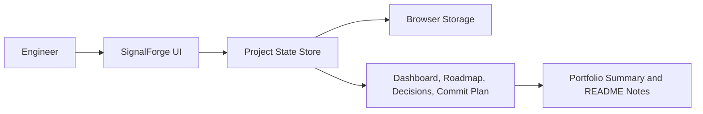

# Developer Project Lab

This repository is a weekly portfolio-building workspace. Each project is planned, built, documented, verified, and committed like production software, with one meaningful progress commit per scheduled work session.

## Current Proposal: SignalForge

SignalForge is an original project-planning and execution dashboard for software engineers who want their GitHub activity to tell a stronger story. Instead of only tracking tasks, it connects a project idea to architecture decisions, daily commits, feature proof, test status, and a final portfolio narrative.

The first week will build SignalForge as a polished front-end application with local-first data. Later weeks can extend it with backend persistence, GitHub integration, AI-assisted project scoring, exportable README generation, and analytics.

## Why This Project Is Useful

- Helps plan portfolio projects before writing code.
- Tracks daily engineering progress in a way that maps naturally to Git commits.
- Produces recruiter-friendly summaries, diagrams, feature evidence, and retrospectives.
- Can later become a real personal operating system for building advanced GitHub projects.

## Proposed Tools

- React with TypeScript for a maintainable front-end codebase.
- Vite for fast local development and production builds.
- CSS modules or modern plain CSS for a custom, professional UI.
- LocalStorage or IndexedDB for the first local-first version.
- Vitest for focused unit tests once application logic is introduced.
- Mermaid diagrams in documentation for architecture and workflow explanation.
- Optional later backend: Node.js and Express or a lightweight API service if persistence, authentication, or GitHub sync becomes useful.

## Week 1 Plan

| Day | Goal | Expected Commit |
| --- | --- | --- |
| 1 | Approve project, scaffold app, document architecture, create initial UI shell | `docs: propose SignalForge architecture` or `chore: scaffold signalforge app` |
| 2 | Build project workspace dashboard and weekly roadmap model | `feat(signalforge): add roadmap dashboard` |
| 3 | Add feature cards, status transitions, and daily commit planning | `feat(signalforge): add commit planning workflow` |
| 4 | Add architecture decision records and diagram preview content | `feat(signalforge): add architecture decision tracking` |
| 5 | Add validation, empty states, responsive polish, and persistence | `feat(signalforge): persist project workspace state` |
| 6 | Add tests, sample data, keyboard-friendly workflows, and UI refinement | `test(signalforge): cover planning state logic` |
| 7 | Finalize documentation, polish UX, verify build, and write retrospective | `docs(signalforge): add week one retrospective` |

## Architecture Overview

## Approval Status

Status: pending approval.

Before implementation begins, review the proposal above. Once approved, the first build step will scaffold the application and create the initial professional UI shell.

