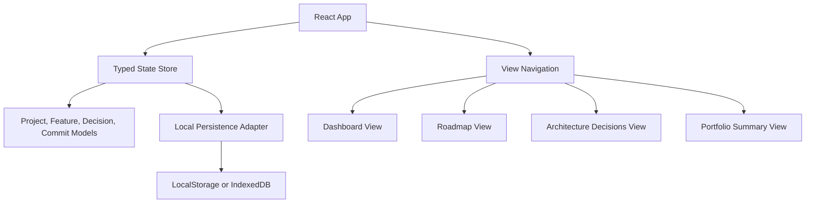
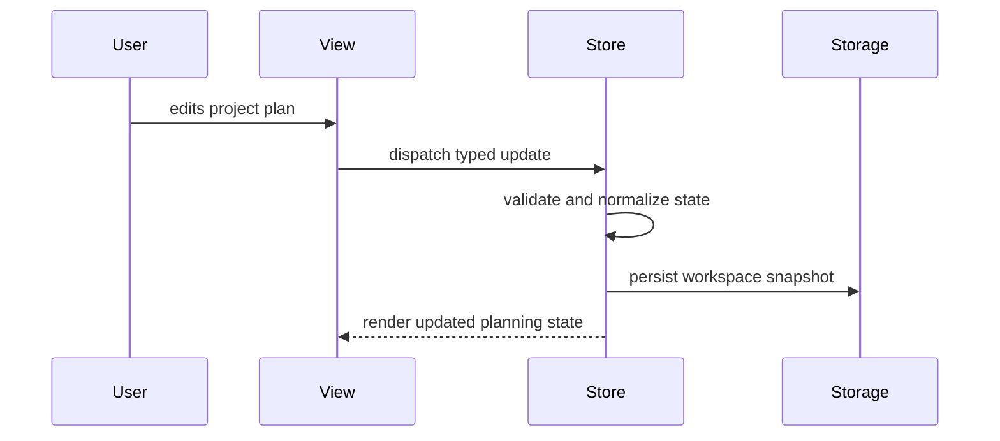

# SignalForge Architecture Proposal

## Product Summary

SignalForge is a local-first dashboard for planning and proving advanced software projects. It is designed for engineers who want every project to have a clear purpose, visible architecture, a strong commit story, and reusable portfolio documentation.

This is not a copied tutorial project. The idea combines project planning, architecture review, commit narrative design, and portfolio evidence into one developer-focused workflow.

## Target Users

- Software engineers building public GitHub portfolio projects.
- Students moving beyond toy examples into useful applications.
- Developers who want each commit to show intentional product and engineering progress.

## Core Features

- Project brief: define audience, problem, value, and success criteria.
- Weekly roadmap: plan seven days of scoped engineering progress.
- Feature board: track planned, active, blocked, and completed features.
- Commit planner: convert daily progress into clear commit messages and proof points.
- Architecture decisions: record technical choices, alternatives, and consequences.
- Portfolio summary: generate documentation-ready project highlights.

## Initial Technical Architecture



## State Flow



## Proposed Folder Structure

```text
signalforge/
  src/
    app/
      App.tsx
      routes.ts
    components/
      AppShell.tsx
      StatusBadge.tsx
      Toolbar.tsx
    features/
      dashboard/
      roadmap/
      decisions/
      summary/
    lib/
      persistence.ts
      project-state.ts
      validation.ts
    styles/
      global.css
  tests/
  README.md
```

## Engineering Standards

- Keep components focused and composable.
- Separate state logic from visual components.
- Use accessible labels, keyboard-friendly controls, and responsive layout rules.
- Add tests for state transitions and validation once the state model exists.
- Keep documentation current with each major feature commit.

## Approval Gate

Implementation should begin only after the project proposal is approved. The first implementation commit should scaffold the app and create the initial layout, sample state, and navigation.

