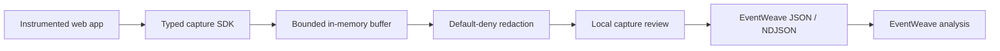

# Next project proposal: TraceRelay

> Status: proposal only. Do not implement until the user explicitly approves it.

## Product idea

TraceRelay is a privacy-first capture companion for EventWeave. A development team adds a small typed browser SDK to an application, starts an opt-in capture for one test or customer-reproduction journey, reviews and redacts the recorded fields locally, then exports an EventWeave-compatible JSON or NDJSON trace with a stable trace ID.

This addresses EventWeave's most important boundary: many applications do not already produce the structured trace file that EventWeave analyzes.

## Target users

- Front-end and QA engineers reproducing customer-facing workflow failures.
- Support engineers who need a sanitized trace without direct production-log access.
- Teams that want a local capture path before adopting a full telemetry platform.

## Proposed first-week scope

1. A typed JavaScript SDK for user actions, state transitions, requests, responses, renders, outcomes, durations, and explicit parent relationships.
2. Opt-in start/stop capture with bounded memory and a visible recording state.
3. Default-deny attribute collection plus configurable key redaction and value masking.
4. Stable session and trace IDs with deterministic EventWeave schema export.
5. A local capture-review screen that previews event count, actors, types, and redaction results before download.
6. A small instrumented demo journey proving successful and failed exports open correctly in EventWeave.
7. Focused validation, privacy, size-limit, ordering, and export compatibility tests.

## Explicit non-goals

- No invisible production recording.
- No collection of passwords, payment details, tokens, or arbitrary DOM contents.
- No backend telemetry warehouse or multi-tenant account system.
- No universal source-code or log linking; applications may add safe references through documented attributes later.
- No automatic upload to EventWeave in the first release.

## Architecture direction

## Approval question

Should TraceRelay be the next project after EventWeave, with the first release limited to explicit local capture, redaction review, and EventWeave-compatible export?
