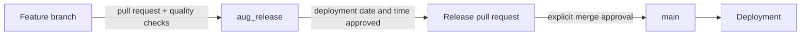

# Release Workflow

This repository uses a two-stage promotion path so feature review stays separate from deployment approval.

## Branch Roles

- `main` is the deployment branch. It only receives reviewed release promotions.
- `aug_release` is the current integration branch for approved project work.
- `codex/*` and other feature branches contain scoped implementation changes.

## Feature Delivery

1. Start a feature branch from the latest `aug_release`.
2. Keep implementation, tests, and documentation together in focused commits.
3. Open a pull request from the feature branch into `aug_release`.
4. Require the **Project quality** workflow to pass before approval.
5. Merge only after explicit user approval.

## Deployment Promotion

1. Choose and record the deployment date, time, and timezone.
2. Pause new release-bound merges while the deployment candidate is reviewed.
3. Open a pull request from `aug_release` into `main` with release notes and the agreed deployment window.
4. Run the same project-quality checks against the promotion pull request.
5. Merge at the approved deployment time only after explicit user authorization.
6. Confirm the deployed revision and record any follow-up work.

The workflow never schedules or performs a `main` merge automatically. The deployment window remains a deliberate human decision.

## Automated Quality Gate

The repository workflow discovers Node projects by their `package.json` files. Each project is installed independently with `npm ci`, then its lint, test, and build scripts run when present. This keeps future project folders covered without duplicating workflow jobs.

The workflow runs for:

- pull requests targeting `aug_release`;
- pull requests targeting `main`;
- pushes to `aug_release`; and
- manual workflow dispatches.
