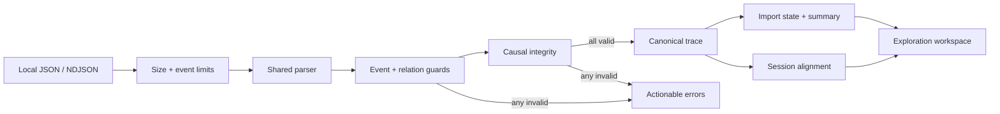

# EventWeave

> Project status: approved and in active development. Validated local import, causal integrity, and deterministic session comparison are complete on the shared EventWeave feature branch.

EventWeave is a privacy-first workflow trace explorer for front-end engineers. It turns JSON or newline-delimited event logs into an interactive view of user journeys, state transitions, latency, and failure clusters without uploading product telemetry to an external service.

## Why It Is Useful

Debugging a multi-step browser workflow often means switching between console output, network traces, screenshots, and loosely structured notes. Raw logs preserve detail but hide causality: an engineer can see that an error occurred without quickly understanding which earlier action or state transition made it likely.

EventWeave provides a focused local analysis workspace. A developer can import a sanitized trace, inspect its timeline, follow causal relationships, compare successful and failed sessions, and export a concise debugging report for an issue or pull request.

## Target Users

- Front-end engineers debugging complex user journeys.
- QA and product engineers comparing successful and failed sessions.
- Teams that cannot send internal telemetry to a third-party analysis service.
- Developers who need reproducible evidence for bugs, performance work, and code reviews.

## Core Features

- Import validated JSON and NDJSON traces with a [documented sample schema](./docs/trace-format.md).
- Normalize events into sessions, spans, actors, state transitions, and relationships.
- Explore a zoomable timeline with latency and error emphasis.
- Follow causal chains between user actions, requests, state changes, and failures.
- Filter by session, event type, actor, duration, and outcome.
- Compare a successful trace with a failed trace to surface the first meaningful divergence.
- Run transparent local heuristics for slow spans, repeated failures, and missing completion events.
- Save analysis state locally and export a Markdown debugging report.
- Include accessible table alternatives for every graphical view.

## Technology

- React and TypeScript for a typed interactive analysis workspace.
- Vite for local development and production builds.
- A dedicated Web Worker boundary for parsing without blocking future interactions.
- IndexedDB for local traces and saved investigations later in the build.
- Vitest for parser, normalization, worker-contract, comparison, and heuristic tests.
- SVG with focused utility functions for the first timeline and causal graph.

## Getting Started

```bash
cd eventweave
npm install
npm run dev
```

Quality commands:

```bash
npm run lint
npm test
npm run build
```

## Current Implementation

The current Atlas and Lumen increments establish a tested core contract and the first usable local-import workflow:

- A versioned product-neutral event model with narrow primitive attributes.
- A shared parser for JSON envelopes and line-aware NDJSON.
- Transactional validation for field types, limits, duplicate IDs, and missing parent relations.
- Deterministic session, event, outcome, duration, and causal-relation normalization.
- Same-session, time-consistent, acyclic parent-link enforcement before causal evidence is accepted.
- A deterministic causal-chain selector that separates explicit parent evidence from timeline sequence context.
- A typed worker request/response contract and module worker entry.
- A worker-backed select-or-drop import panel with stale-result suppression, failure recovery, and a semantic session summary.
- A deterministic session-alignment engine that reports match basis, confidence, unmatched events, and the first meaningful divergence.
- Successful and failed checkout fixtures that model the same realistic journey.
- A responsive, accessible React workspace that communicates the local-only product promise.



## Project Structure

```text
eventweave/
  docs/
    architecture.md
    trace-format.md
  public/samples/
    checkout-success.json
    checkout-failure.ndjson
  src/
    app/
    lib/
      trace-model.ts
      trace-parser.ts
      trace-parser.test.ts
    styles/
    workers/
      trace-import-contract.ts
      trace-import.worker.ts
  README.md
```

## One-Week Delivery Plan

1. **Complete:** trace format, application scaffold, fixtures, validated local import, and first-divergence comparison foundation.
2. **Next:** session navigation and an accessible event timeline.
3. Causal-chain exploration across actions, requests, and state transitions.
4. Comparison workflow UI on the implemented first-divergence engine.
5. Transparent performance and failure heuristics with saved investigations.
6. Markdown reporting, expanded samples, keyboard checks, and browser integration tests.
7. Responsive polish, documentation, retrospective, and the next written proposal.

## Atlas handoff to Lumen

- Reviewed Lumen commit: `c444ff7` (`Add local trace import workspace with worker validation`); the reducer retains prior valid evidence on replacement failure and suppresses stale reader or worker results.
- Commit: `03959ad` (`feat(eventweave): compare trace session divergence`).
- Verification: 22 Vitest tests, strict TypeScript lint, Vite production build, and `git diff --check`.
- Open risks: comparison is a pure domain boundary and is not yet wired into UI state. The shared branch still has no remote PR until publication succeeds.
- Next distinct task: add session navigation and an accessible event timeline/table that consumes the retained normalized trace, supports keyboard selection, and gives the existing causal selector a visible focus target.
