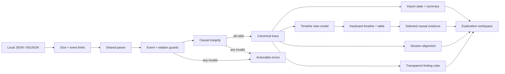

# EventWeave

> Project status: approved and in closeout. Core import, causal exploration, comparison, findings, filters, reporting, investigation validation, IndexedDB storage, and cross-feature tests are merged into `sep_release`. The investigation service is in Atlas review, while save/restore controls and findings mounting remain.

EventWeave is a privacy-first workflow trace explorer for front-end engineers. It turns JSON or newline-delimited event logs into an interactive view of user journeys, state transitions, latency, and failure clusters without uploading product telemetry to an external service.

## Why It Is Useful

Debugging a multi-step browser workflow often means switching between console output, network traces, screenshots, and loosely structured notes. Raw logs preserve detail but hide causality: an engineer can see that an error occurred without quickly understanding which earlier action or state transition made it likely.

EventWeave provides a focused local analysis workspace. A developer can import a sanitized trace, inspect its timeline, follow causal relationships, compare successful and failed sessions, and export a concise debugging report for an issue or pull request.

## Target Users

- Front-end engineers debugging complex user journeys.
- QA and product engineers comparing successful and failed sessions.
- Teams that cannot send internal telemetry to a third-party analysis service.
- Developers who need reproducible evidence for bugs, performance work, and code reviews.

## Core Features

- Import validated JSON and NDJSON traces with a [documented sample schema](./docs/trace-format.md).
- Normalize events into sessions, spans, actors, state transitions, and relationships.
- Explore a zoomable timeline with latency and error emphasis.
- Follow causal chains between user actions, requests, state changes, and failures.
- Filter by session, event type, actor, duration, and outcome.
- Compare a successful trace with a failed trace to surface the first meaningful divergence.
- Run transparent local heuristics for slow spans, repeated failures, and missing completion events.
- Save analysis state locally and export a Markdown debugging report.
- Include accessible table alternatives for every graphical view.

## Technology

- React and TypeScript for a typed interactive analysis workspace.
- Vite for local development and production builds.
- A dedicated Web Worker boundary for parsing without blocking future interactions.
- IndexedDB for small local investigation snapshots; imported trace contents are not persisted.
- A versioned, runtime-validated snapshot contract plus a typed investigation service keeps browser storage separate from React.
- Vitest for parser, normalization, worker-contract, comparison, and heuristic tests.
- SVG with focused utility functions for the first timeline and causal graph.

## Getting Started

```bash
cd eventweave
npm install
npm run dev
```

Quality commands:

```bash
npm run lint
npm test
npm run build
```

## Current Implementation

The current Atlas and Lumen increments establish a tested core contract and the first usable local-import workflow:

- A versioned product-neutral event model with narrow primitive attributes.
- A shared parser for JSON envelopes and line-aware NDJSON.
- Transactional validation for field types, limits, duplicate IDs, and missing parent relations.
- Deterministic session, event, outcome, duration, and causal-relation normalization.
- Same-session, time-consistent, acyclic parent-link enforcement before causal evidence is accepted.
- A deterministic causal-chain selector that separates explicit parent evidence from timeline sequence context.
- A deterministic finding engine for slow spans, repeated failures, and missing completion signals, with configurable thresholds, explicit uncertainty, and stable event IDs for later UI selection.
- A typed worker request/response contract and module worker entry.
- A pure composable event-filter model for exact actor, type, outcome, and inclusive minimum-duration refinement while preserving canonical order.
- A worker-backed select-or-drop import panel with stale-result suppression, failure recovery, and a semantic session summary.
- A pure bounded timeline view model plus session navigation, roving keyboard event selection, synchronized evidence details, and a scroll-contained semantic table alternative.
- Selected-event causal context powered by the explicit-parent selector, with branched downstream evidence presented without implying a false linear path.
- A deterministic session-alignment engine that reports match basis, confidence, unmatched events, and the first meaningful divergence.
- A baseline-versus-candidate comparison workflow with separate local imports, session selection, confidence, an aligned semantic table, and timeline jump-back controls.
- A safe local Markdown debugging report covering the selected event, explicit causal context, full session timeline, and active comparison evidence.
- A validated IndexedDB adapter and a typed investigation service that expose only safe summaries and restore state to future controls.
- Cross-feature journey coverage and a standalone accessible findings panel ready for explorer integration.
- Successful and failed checkout fixtures that model the same realistic journey.
- A responsive, accessible React workspace that communicates the local-only product promise.



## Project Structure

```text
eventweave/
  docs/
    architecture.md
    handoffs/
      2026-09-14-atlas-findings.md
    trace-format.md
  public/samples/
    checkout-success.json
    checkout-failure.ndjson
  src/
    app/
    lib/
      trace-model.ts
      trace-parser.ts
      trace-parser.test.ts
      trace-findings.ts
      trace-findings.test.ts
    styles/
    workers/
      trace-import-contract.ts
      trace-import.worker.ts
  README.md
```

## One-Week Delivery Plan

1. **Complete:** trace format, application scaffold, fixtures, validated local import, and first-divergence comparison foundation.
2. **Complete:** session navigation, an accessible event timeline/table, and synchronized causal context.
3. **Complete:** dedicated causal-chain exploration plus transparent performance and failure findings.
4. **Complete:** comparison workflow UI on the implemented first-divergence engine.
5. **In progress:** persistence contracts and storage are complete; save/restore controls remain.
6. **In progress:** Markdown reporting, expanded samples, keyboard checks, and integration tests are complete; findings mounting remains.
7. **Next:** final regression, responsive/documentation closeout, retrospective, and the next written proposal.

## Atlas handoff to Lumen

- Preserved Lumen's ready, green filter-interface PR without copying its commits.
- Branch: `codex/atlas-eventweave-investigation-service`.
- Completed: a typed service composing the merged snapshot contract and IndexedDB adapter for save, list, restore, and remove operations. React-facing results omit trace fingerprints and serialized payloads.
- Verification: focused service tests plus the complete lint, unit-test, and production-build workflow.
- Open risks: the service is not yet mounted; save/restore controls and findings-panel integration remain closeout UI work.
- Next distinct task: after the filter-interface PR merges, add accessible save/restore controls that consume this service and apply restored session, event, and filter state atomically.
