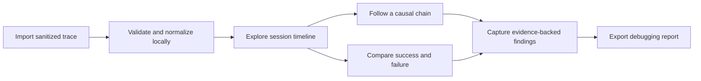

# EventWeave

> Proposal status: awaiting approval. No implementation has started.

EventWeave is a privacy-first workflow trace explorer for front-end engineers. It turns JSON or newline-delimited event logs into an interactive view of user journeys, state transitions, latency, and failure clusters without uploading product telemetry to an external service.

## Why It Is Useful

Debugging a multi-step browser workflow often means switching between console output, network traces, screenshots, and loosely structured notes. Raw logs preserve detail but hide causality: an engineer can see that an error occurred without quickly understanding which earlier action or state transition made it likely.

EventWeave would provide a focused local analysis workspace. A developer could import a sanitized trace, inspect its timeline, follow causal relationships, compare successful and failed sessions, and export a concise debugging report for an issue or pull request.

## Target Users

- Front-end engineers debugging complex user journeys.
- QA and product engineers comparing successful and failed sessions.
- Teams that cannot send internal telemetry to a third-party analysis service.
- Developers who need reproducible evidence for bugs, performance work, and code reviews.

## Proposed Core Features

- Import validated JSON and NDJSON traces with a documented sample schema.
- Normalize events into sessions, spans, actors, state transitions, and relationships.
- Explore a zoomable timeline with latency and error emphasis.
- Follow causal chains between user actions, requests, state changes, and failures.
- Filter by session, event type, actor, duration, and outcome.
- Compare a successful trace with a failed trace to surface the first meaningful divergence.
- Run transparent local heuristics for slow spans, repeated failures, and missing completion events.
- Save analysis state locally and export a Markdown debugging report.
- Include accessible table alternatives for every graphical view.

## Proposed Tools

- React and TypeScript for a typed interactive analysis workspace.
- Vite for fast local development and production builds.
- SVG with focused utility functions for the first timeline and causal graph; a larger visualization dependency will be added only if the interaction model justifies it.
- Web Workers for parsing larger traces without blocking the interface.
- IndexedDB for local traces and saved investigations.
- Vitest for parsers, normalization, comparison, and heuristic tests.
- Playwright for import, filtering, keyboard navigation, and responsive smoke tests if the repository workflow supports it.

## Proposed Folder Structure

```text
eventweave/
  docs/
    architecture.md
    trace-format.md
  public/
    samples/
  src/
    app/
    components/
    features/
      import/
      timeline/
      causality/
      comparison/
      report/
    lib/
      trace-parser.ts
      trace-model.ts
      trace-analysis.ts
    workers/
    styles/
  tests/
  README.md
```

## Proposed User Flow



## One-Week Implementation Plan

1. Document the trace format, scaffold the application, and implement validated local import.
2. Build session navigation and an accessible event timeline.
3. Add causal-chain exploration across actions, requests, and state transitions.
4. Add trace comparison and first-divergence analysis.
5. Add transparent performance and failure heuristics with saved investigations.
6. Add Markdown reporting, realistic sample traces, tests, and keyboard/accessibility checks.
7. Complete responsive polish, documentation, and the project retrospective.

## Approval Gate

Implementation should begin only after the user approves this proposal. Approval should confirm the project idea and the `eventweave/` folder as the next weekly portfolio project. Until then, this folder contains documentation only.
