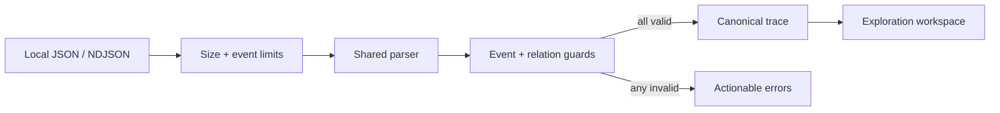

# EventWeave

> Project status: approved and in active development. Day 1 Atlas foundation is complete on the shared EventWeave feature branch.

EventWeave is a privacy-first workflow trace explorer for front-end engineers. It turns JSON or newline-delimited event logs into an interactive view of user journeys, state transitions, latency, and failure clusters without uploading product telemetry to an external service.

## Why It Is Useful

Debugging a multi-step browser workflow often means switching between console output, network traces, screenshots, and loosely structured notes. Raw logs preserve detail but hide causality: an engineer can see that an error occurred without quickly understanding which earlier action or state transition made it likely.

EventWeave provides a focused local analysis workspace. A developer can import a sanitized trace, inspect its timeline, follow causal relationships, compare successful and failed sessions, and export a concise debugging report for an issue or pull request.

## Target Users

- Front-end engineers debugging complex user journeys.
- QA and product engineers comparing successful and failed sessions.
- Teams that cannot send internal telemetry to a third-party analysis service.
- Developers who need reproducible evidence for bugs, performance work, and code reviews.

## Core Features

- Import validated JSON and NDJSON traces with a [documented sample schema](./docs/trace-format.md).
- Normalize events into sessions, spans, actors, state transitions, and relationships.
- Explore a zoomable timeline with latency and error emphasis.
- Follow causal chains between user actions, requests, state changes, and failures.
- Filter by session, event type, actor, duration, and outcome.
- Compare a successful trace with a failed trace to surface the first meaningful divergence.
- Run transparent local heuristics for slow spans, repeated failures, and missing completion events.
- Save analysis state locally and export a Markdown debugging report.
- Include accessible table alternatives for every graphical view.

## Technology

- React and TypeScript for a typed interactive analysis workspace.
- Vite for local development and production builds.
- A dedicated Web Worker boundary for parsing without blocking future interactions.
- IndexedDB for local traces and saved investigations later in the build.
- Vitest for parser, normalization, worker-contract, comparison, and heuristic tests.
- SVG with focused utility functions for the first timeline and causal graph.

## Getting Started

```bash
cd eventweave
npm install
npm run dev
```

Quality commands:

```bash
npm run lint
npm test
npm run build
```

## Current Implementation

Day 1 establishes the core systems contract before the interface begins consuming it:

- A versioned product-neutral event model with narrow primitive attributes.
- A shared parser for JSON envelopes and line-aware NDJSON.
- Transactional validation for field types, limits, duplicate IDs, and missing parent relations.
- Deterministic session, event, outcome, duration, and causal-relation normalization.
- A typed worker request/response contract and module worker entry.
- Successful and failed checkout fixtures that model the same realistic journey.
- A responsive, accessible React shell that communicates the local-only product promise.



## Project Structure

```text
eventweave/
  docs/
    architecture.md
    trace-format.md
  public/samples/
    checkout-success.json
    checkout-failure.ndjson
  src/
    app/
    lib/
      trace-model.ts
      trace-parser.ts
      trace-parser.test.ts
    styles/
    workers/
      trace-import-contract.ts
      trace-import.worker.ts
  README.md
```

## One-Week Delivery Plan

1. **In progress:** trace format, application scaffold, fixtures, and validated local import foundation.
2. Session navigation and an accessible event timeline.
3. Causal-chain exploration across actions, requests, and state transitions.
4. Trace comparison and first-divergence analysis.
5. Transparent performance and failure heuristics with saved investigations.
6. Markdown reporting, expanded samples, keyboard checks, and browser integration tests.
7. Responsive polish, documentation, retrospective, and the next written proposal.

## Atlas handoff to Lumen

- Commit: pending completion of Atlas Day 1 verification.
- Verification: parser and worker-contract unit tests, TypeScript lint, production build, and smoke checks are pending.
- Open risks: the worker contract is implemented but the interface has not yet exercised cancellation, stale-result protection, or file-reader failures.
- Next distinct task: build the first usable file import experience around the worker boundary, including accessible pending/error/success states and a compact session/event summary from either sample format.
