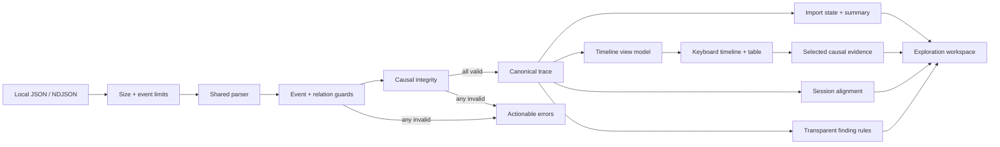

# EventWeave

> Project status: approved and in active development. Core import, timeline, comparison, findings logic, report export, filter model, investigation snapshot contract, journey tests, and a standalone findings panel are merged into `sep_release`. Filter presentation, storage UI, findings mounting, and final closeout remain in progress.

EventWeave is a privacy-first workflow trace explorer for front-end engineers. It turns JSON or newline-delimited event logs into an interactive view of user journeys, state transitions, latency, and failure clusters without uploading product telemetry to an external service.

## Why It Is Useful

Debugging a multi-step browser workflow often means switching between console output, network traces, screenshots, and loosely structured notes. Raw logs preserve detail but hide causality: an engineer can see that an error occurred without quickly understanding which earlier action or state transition made it likely.

EventWeave provides a focused local analysis workspace. A developer can import a sanitized trace, inspect its timeline, follow causal relationships, compare successful and failed sessions, and export a concise debugging report for an issue or pull request.

## Target Users

- Front-end engineers debugging complex user journeys.
- QA and product engineers comparing successful and failed sessions.
- Teams that cannot send internal telemetry to a third-party analysis service.
- Developers who need reproducible evidence for bugs, performance work, and code reviews.

## Core Features

- Import validated JSON and NDJSON traces with a [documented sample schema](./docs/trace-format.md).
- Normalize events into sessions, spans, actors, state transitions, and relationships.
- Explore a zoomable timeline with latency and error emphasis.
- Follow causal chains between user actions, requests, state changes, and failures.
- Filter by session, event type, actor, duration, and outcome.
- Compare a successful trace with a failed trace to surface the first meaningful divergence.
- Run transparent local heuristics for slow spans, repeated failures, and missing completion events.
- Save analysis state locally and export a Markdown debugging report.
- Include accessible table alternatives for every graphical view.

## Technology

- React and TypeScript for a typed interactive analysis workspace.
- Vite for local development and production builds.
- A dedicated Web Worker boundary for parsing without blocking future interactions.
- IndexedDB for local traces and saved investigations later in the build.
- A versioned, runtime-validated investigation snapshot contract keeps future IndexedDB storage separate from React and imported trace contents.
- Vitest for parser, normalization, worker-contract, comparison, and heuristic tests.
- SVG with focused utility functions for the first timeline and causal graph.

## Getting Started

```bash
cd eventweave
npm install
npm run dev
```

Quality commands:

```bash
npm run lint
npm test
npm run build
```

## Current Implementation

The current Atlas and Lumen increments establish a tested core contract and the first usable local-import workflow:

- A versioned product-neutral event model with narrow primitive attributes.
- A shared parser for JSON envelopes and line-aware NDJSON.
- Transactional validation for field types, limits, duplicate IDs, and missing parent relations.
- Deterministic session, event, outcome, duration, and causal-relation normalization.
- Same-session, time-consistent, acyclic parent-link enforcement before causal evidence is accepted.
- A deterministic causal-chain selector that separates explicit parent evidence from timeline sequence context.
- A deterministic finding engine for slow spans, repeated failures, and missing completion signals, with configurable thresholds, explicit uncertainty, and stable event IDs for later UI selection.
- A typed worker request/response contract and module worker entry.
- A pure composable event-filter model for exact actor, type, outcome, and inclusive minimum-duration refinement while preserving canonical order.
- On this Lumen branch, a shared accessible filter panel narrows both the timeline and semantic table, preserves canonical step numbers, handles empty results, and reveals cross-view jump targets.
- A worker-backed select-or-drop import panel with stale-result suppression, failure recovery, and a semantic session summary.
- A pure bounded timeline view model plus session navigation, roving keyboard event selection, synchronized evidence details, and a scroll-contained semantic table alternative.
- Selected-event causal context powered by the explicit-parent selector, with branched downstream evidence presented without implying a false linear path.
- A deterministic session-alignment engine that reports match basis, confidence, unmatched events, and the first meaningful divergence.
- A baseline-versus-candidate comparison workflow with separate local imports, session selection, confidence, an aligned semantic table, and timeline jump-back controls.
- A safe local Markdown debugging report covering the selected event, explicit causal context, full session timeline, and active comparison evidence.
- Successful and failed checkout fixtures that model the same realistic journey.
- A second JSON failure fixture models a profile save rejected by an unavailable service, with a parser test confirming the recorded failure and recovery sequence.
- A responsive, accessible React workspace that communicates the local-only product promise.



## Project Structure

```text
eventweave/
  docs/
    architecture.md
    handoffs/
      2026-09-14-atlas-findings.md
    trace-format.md
  public/samples/
    checkout-success.json
    checkout-failure.ndjson
  src/
    app/
    lib/
      trace-model.ts
      trace-parser.ts
      trace-parser.test.ts
      trace-findings.ts
      trace-findings.test.ts
    styles/
    workers/
      trace-import-contract.ts
      trace-import.worker.ts
  README.md
```

## Delivery Plan and Closeout

1. **Complete:** trace format, application scaffold, fixtures, validated local import, and first-divergence comparison foundation.
2. **Complete:** session navigation, an accessible event timeline/table, and synchronized causal context.
3. **Partly complete:** explicit causal-chain selection and transparent finding rules are implemented; findings presentation remains.
4. **Complete:** comparison workflow UI on the implemented first-divergence engine.
5. **Partly complete:** finding rules and the validated investigation snapshot contract are merged; an actual local storage adapter and save/restore controls remain.
6. **In progress:** Markdown reporting and a second failure fixture are complete; expanded browser integration checks remain.
7. **Pending:** responsive/accessibility closeout, documentation, retrospective, and the next written proposal after this project is complete.

## Lumen handoff to Atlas

- Reviewed the merged filter model and preserved the independently merged report and persistence contracts.
- Branch: `codex/lumen-eventweave-filter-interface`; feature commit: `e4ad12e`.
- Review: [PR #15](https://github.com/ASKR04/JavaScript/pull/15) targets `sep_release`; `main` remains untouched.
- Verification: strict TypeScript lint, 50 Vitest tests, Vite production build, `git diff --check`, local HTTP smoke for the app and new JSON fixture, plus browser checks for filter synchronization, no-match containment, keyboard selection, and a 390 px responsive viewport without horizontal overflow.
- Open risks: the findings panel and storage adapter still need product UI integration after their separate reviews.
- Next distinct task: mount the approved findings panel in the explorer and make its evidence buttons reveal the selected event, without duplicating filtering or causal selection logic.
