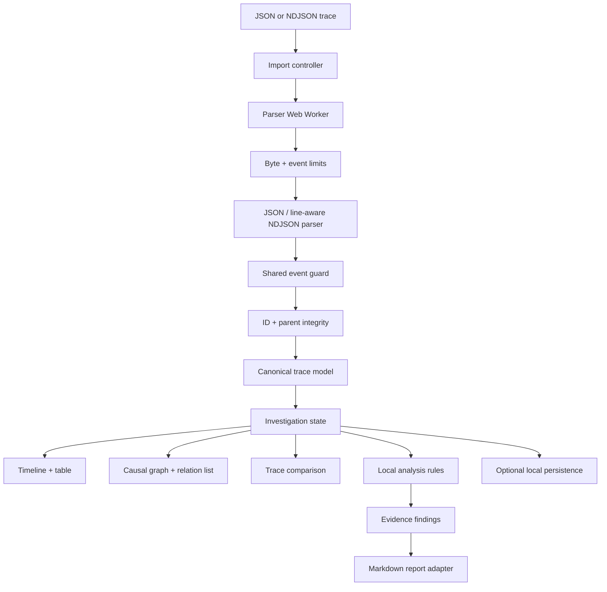
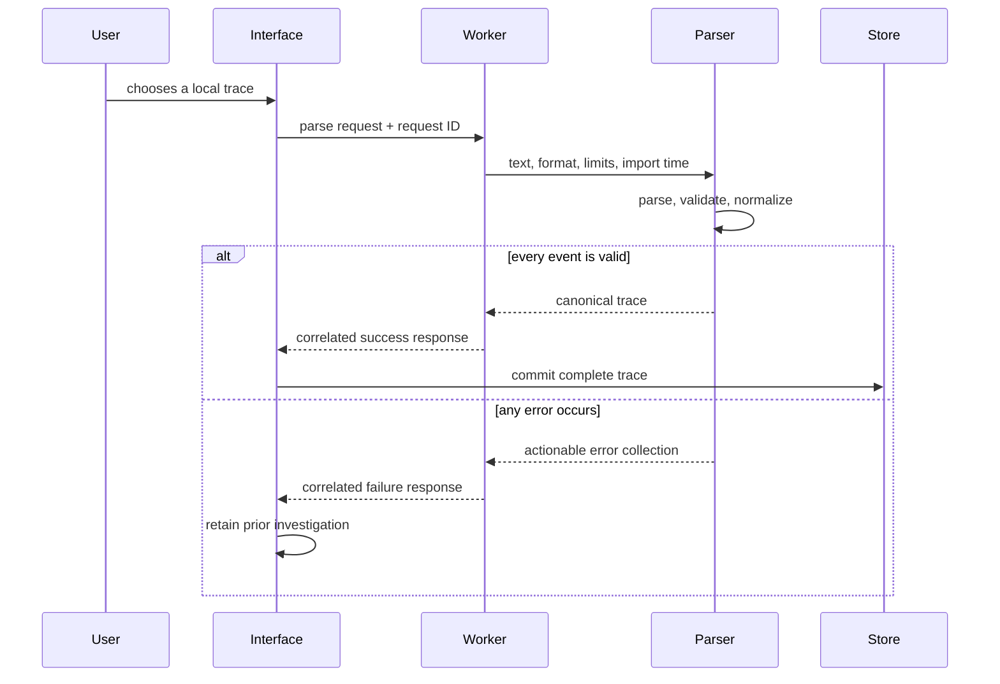

# EventWeave Architecture

> Status: approved and active. This document records the implemented Day 1 core boundary and the planned extension points for the one-week delivery cycle.

## Architecture Goals

- Keep imported telemetry on the user's device.
- Make parsing and analysis deterministic and testable outside React.
- Keep large-file work off the main interface thread.
- Pair every visualization with an accessible textual representation.
- Explain every heuristic so findings remain reviewable engineering evidence.

## System Design

Solid parsing and normalization nodes are implemented. The import controller and analysis consumers remain deliberate extension points for subsequent shifts.

## Implemented Domain Model

The canonical model separates untrusted imported data from derived analysis:

- `TraceEvent`: stable ID, session identity, timestamp, type, actor, message, duration, outcome, optional parent, and primitive attributes.
- `TraceSession`: identity, start/end time, duration, derived outcome, and ordered event references.
- `TraceRelation`: explicit parent and deterministic within-session sequence edges.
- `NormalizedTrace`: version, import time, sorted events, sessions, and relations.
- `Investigation` and `Finding` will be added when interactive selection and heuristics require them.

Imported attributes remain primitive unknown data behind runtime guards. Arbitrary nested telemetry is rejected instead of being trusted through a TypeScript assertion.

## Import and State Flow

The request ID makes stale-result suppression possible without coupling that policy to the worker. The parser has no React, file-system, or browser-storage dependency, so both synchronous tests and worker execution use exactly the same contract.

## Parsing Boundary

The implemented import boundary enforces a 2 MiB file limit and 20,000-event limit before normalization. JSON and NDJSON share one event guard so their contracts cannot drift. NDJSON syntax failures report their source line; all semantic errors identify the event position and stable ID when available.

Validation is transactional: malformed fields, invalid timestamps, negative durations, nested attributes, duplicate IDs, and missing parent references reject the entire import. No partial event list is presented as valid evidence. Events and sessions receive deterministic ordering, including an ID fallback for equal timestamps.

The interface will own file reading, cancellation, progress feedback, and stale-response policy. The worker owns only parsing, validation, and normalization.

## Visualization and Accessibility

Timeline and causal views will consume derived view models rather than raw events. This keeps layout calculations separate from the domain model and makes an equivalent table view straightforward. Keyboard users must be able to move between events, inspect details, change filters, and follow relations without targeting SVG paths.

Color may reinforce latency, outcome, and selection but cannot be the only status signal. Shapes, labels, icons, and accessible descriptions will carry the same meaning. The Day 1 shell already provides visible focus, responsive layout, reduced-motion behavior, and text labels for example states.

## Comparison Strategy

Trace comparison will align events using stable identifiers when present and a documented fallback based on event type, actor, relative order, and normalized labels. The algorithm will expose confidence and stop at the first meaningful divergence rather than claim an exact match when evidence is ambiguous.

The paired checkout fixtures intentionally share the same initial steps before diverging at the payment response, giving the comparison algorithm a realistic deterministic baseline.

## Testing Strategy

- Implemented unit tests for JSON/NDJSON parsing, guards, deterministic normalization, size limits, identity integrity, relation integrity, and worker-message validation.
- Planned property-focused tests for ordering, duration, and relation invariants.
- Planned fixture tests for successful and failed trace comparison.
- Planned rule tests that prove both findings and non-findings.
- Planned component tests for accessible names, filters, and empty/error states.
- Planned browser smoke tests for import, timeline navigation, comparison, report export, and responsive layouts.

## Decisions

1. The approved week-one schema is product-neutral; external adapters such as OpenTelemetry remain explicit future boundaries.
2. Initial visualizations will be SVG-first and paired with semantic tables. A graph library requires demonstrated interaction value.
3. Initial comparison will align two traces rather than infer a baseline group.
4. Imported event extensions are ignored at the top level, while the documented `attributes` bag remains flat and runtime-validated.

## Atlas handoff to Lumen

- Commit: pending completion of Atlas Day 1 verification.
- Verification: parser and worker contract tests, TypeScript lint, Vite production build, and smoke checks are pending.
- Open risks: the worker has not yet been integrated with file reading, cancellation, or UI state, and the initial shell is not an exploration surface.
- Next distinct task: integrate the typed worker into an accessible import panel with drag/select affordances, transaction-safe errors, and a semantic summary of the normalized sessions and events.
