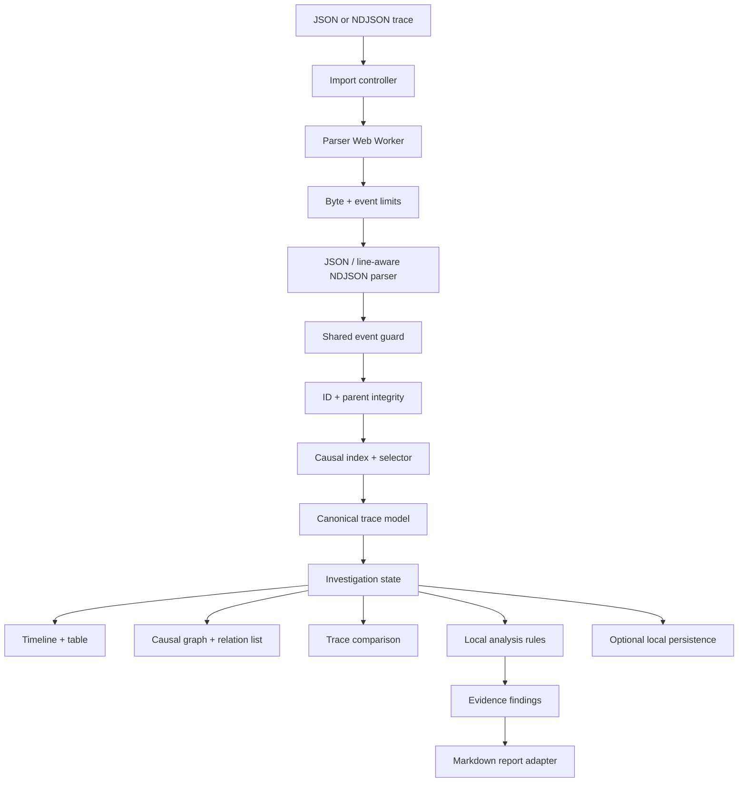
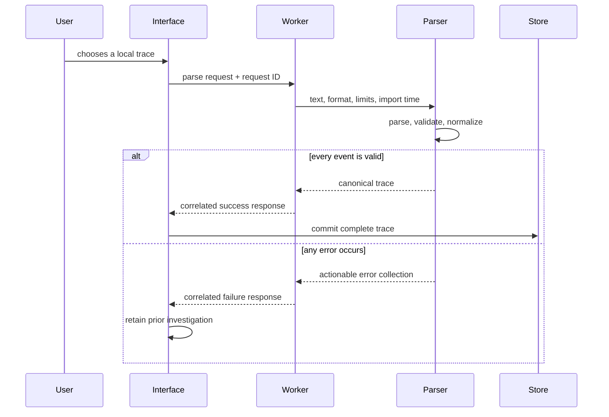

# EventWeave Architecture

> Status: approved and active. This document records the implemented import, causal-integrity, and comparison boundaries plus the planned extension points for the one-week delivery cycle.

## Architecture Goals

- Keep imported telemetry on the user's device.
- Make parsing and analysis deterministic and testable outside React.
- Keep large-file work off the main interface thread.
- Pair every visualization with an accessible textual representation.
- Explain every heuristic so findings remain reviewable engineering evidence.

## System Design

Parsing, normalization, causal validation, causal-chain selection, worker-backed import state, and first-divergence comparison are implemented. Timeline, filtering, persistence, and reporting remain deliberate extension points for subsequent shifts.

## Implemented Domain Model

The canonical model separates untrusted imported data from derived analysis:

- `TraceEvent`: stable ID, session identity, timestamp, type, actor, message, duration, outcome, optional parent, and primitive attributes.
- `TraceSession`: identity, start/end time, duration, derived outcome, and ordered event references.
- `TraceRelation`: explicit parent and deterministic within-session sequence edges.
- `NormalizedTrace`: version, import time, sorted events, sessions, and relations.
- `TraceComparison`: ordered event alignments, match basis, confidence, change signals, and the first meaningful divergence.
- `Investigation` and `Finding` will be added when interactive selection and heuristics require them.

Imported attributes remain primitive unknown data behind runtime guards. Arbitrary nested telemetry is rejected instead of being trusted through a TypeScript assertion.

## Import and State Flow

The request ID makes stale-result suppression possible without coupling that policy to the worker. The parser has no React, file-system, or browser-storage dependency, so both synchronous tests and worker execution use exactly the same contract.

## Parsing Boundary

The implemented import boundary enforces a 2 MiB file limit and 20,000-event limit before normalization. JSON and NDJSON share one event guard so their contracts cannot drift. NDJSON syntax failures report their source line; all semantic errors identify the event position and stable ID when available.

Validation is transactional: malformed fields, invalid timestamps, negative durations, nested attributes, duplicate IDs, and missing parent references reject the entire import. No partial event list is presented as valid evidence. Events and sessions receive deterministic ordering, including an ID fallback for equal timestamps.

The interface owns file reading, progress feedback, and stale-response policy. Its pure reducer keeps the previous valid trace when a replacement read or parse fails, and request correlation prevents an older reader or worker response from replacing newer evidence. The worker owns only parsing, validation, and normalization.

## Causal Integrity and Selection

An explicit parent relation is accepted only when both events belong to the same session, the parent occurs no later than the child, and following parent links cannot form a cycle. These checks run transactionally with the rest of import validation, so an invalid relation cannot become causal evidence.

The pure causal-chain selector indexes events by ID, walks rootward ancestors, gathers downstream branches, and returns events in normalized trace order. It includes only explicit parent relations. Within-session sequence relations remain useful timeline context but are not promoted to causal claims.

## Visualization and Accessibility

Timeline and causal views will consume derived view models rather than raw events. This keeps layout calculations separate from the domain model and makes an equivalent table view straightforward. Keyboard users must be able to move between events, inspect details, change filters, and follow relations without targeting SVG paths.

Color may reinforce latency, outcome, and selection but cannot be the only status signal. Shapes, labels, icons, and accessible descriptions will carry the same meaning. The Day 1 shell already provides visible focus, responsive layout, reduced-motion behavior, and text labels for example states.

## Comparison Strategy

Trace comparison aligns one baseline session with one candidate session through a deterministic, order-preserving pass with bounded lookahead. Stable event identifiers receive exact-match priority. When traces use different identifiers, type, actor, normalized label, and relative order provide an explicit semantic fallback; unrelated events stay unmatched instead of being forced into a pair. The bounded window keeps memory linear and runtime proportional to trace size at the 20,000-event import ceiling.

Each alignment exposes its stable-ID, semantic, or unmatched basis and a numeric confidence contribution. Aggregate confidence is reported as high, medium, or low. Meaningful change signals cover type, actor, normalized label, outcome, attributes, missing events, and material timing or duration shifts; wall-clock start time is deliberately ignored. The first changed alignment becomes the first divergence, while every later alignment remains available for a complete comparison view.

The paired checkout fixtures share the same initial actions. Comparison correctly identifies the payment request as the first divergence because the failed trace marks its outcome as failed and its duration grows from 184 ms to 428 ms; later timeout and recovery differences remain ordered evidence rather than obscuring that earlier signal.

## Testing Strategy

- Implemented unit tests for JSON/NDJSON parsing, guards, deterministic normalization, size limits, identity integrity, relation integrity, and worker-message validation.
- Planned property-focused tests for ordering, duration, and relation invariants.
- Implemented fixture and focused tests for stable-ID priority, semantic alignment, unmatched insertions, missing sessions, confidence, and the first successful-versus-failed checkout divergence.
- Planned rule tests that prove both findings and non-findings.
- Planned component tests for accessible names, filters, and empty/error states.
- Planned browser smoke tests for import, timeline navigation, comparison, report export, and responsive layouts.

## Decisions

1. The approved week-one schema is product-neutral; external adapters such as OpenTelemetry remain explicit future boundaries.
2. Initial visualizations will be SVG-first and paired with semantic tables. A graph library requires demonstrated interaction value.
3. Initial comparison will align two traces rather than infer a baseline group.
4. Imported event extensions are ignored at the top level, while the documented `attributes` bag remains flat and runtime-validated.

## Atlas handoff to Lumen

- Reviewed Lumen commit: `c444ff7` (`Add local trace import workspace with worker validation`); file reading, worker correlation, failure retention, and the first session summary now consume the core import contract.
- Commit: `03959ad` (`feat(eventweave): compare trace session divergence`).
- Verification: 22 Vitest tests, strict TypeScript lint, Vite production build, and `git diff --check`.
- Open risks: comparison remains intentionally UI-agnostic, and browser persistence has not begun. The shared branch still has no remote PR until publication succeeds.
- Next distinct task: build session navigation plus paired accessible timeline/table views with keyboard event selection, then connect the selected event to the existing causal-chain selector without taking on comparison UI yet.
