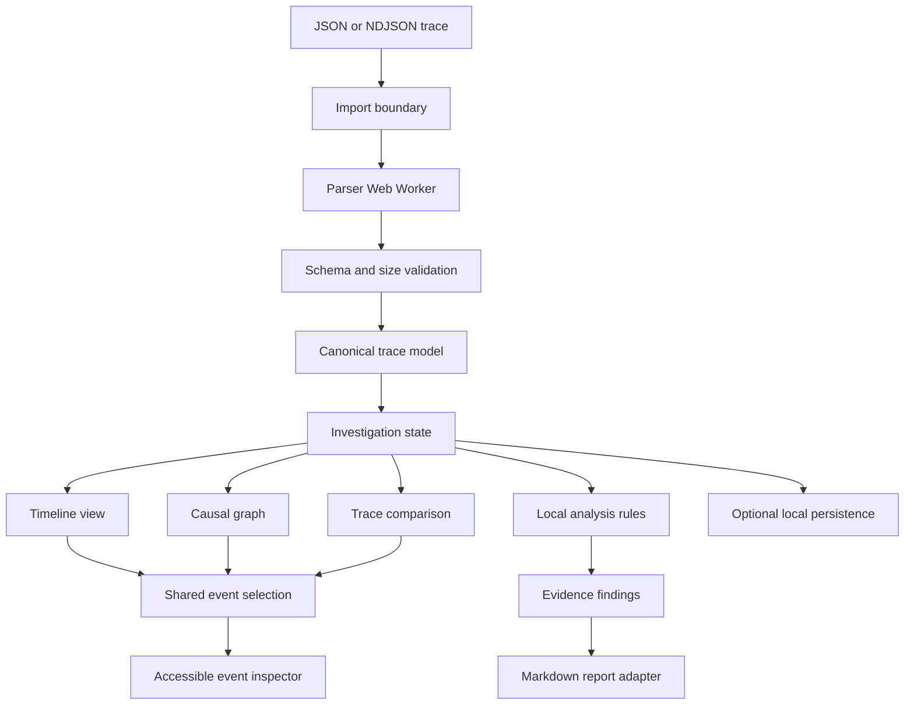
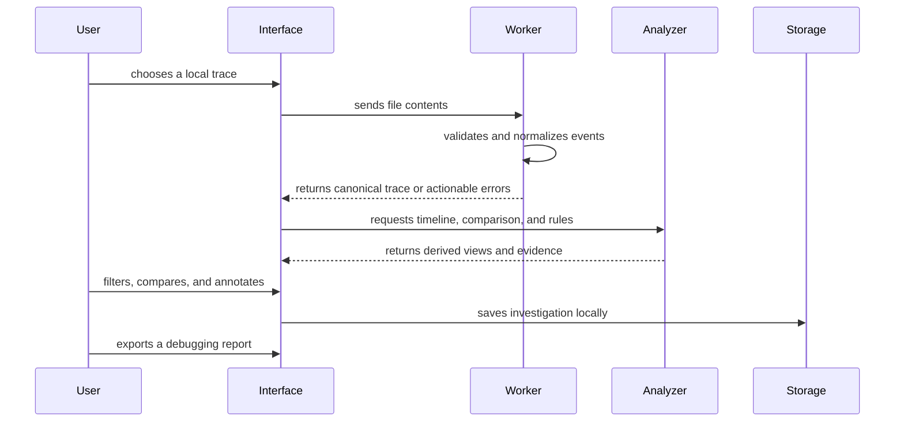

# EventWeave Proposed Architecture

> Proposal status: awaiting approval. This document describes the intended design, not an implemented system.

## Architecture Goals

- Keep imported telemetry on the user's device.
- Make parsing and analysis deterministic and testable outside React.
- Keep large-file work off the main interface thread.
- Pair every visualization with an accessible textual representation.
- Explain every heuristic so findings remain reviewable engineering evidence.

## System Design

## Proposed Domain Model

The canonical model will separate imported data from derived analysis:

- `TraceSession`: identity, start/end time, outcome, and ordered event references.
- `TraceEvent`: timestamp, type, actor, message, attributes, and optional duration.
- `TraceRelation`: explicit or inferred parent, request, state, and sequence relationships.
- `Investigation`: selected sessions, filters, annotations, and saved findings.
- `Finding`: rule identifier, severity, explanation, and supporting event references.

Imported attributes will remain unknown data until accessed through narrow typed guards. This avoids pretending that arbitrary product telemetry is trusted simply because the outer file is valid.

## Data and State Flow

## Parsing Boundary

The import boundary should enforce configurable file and event limits before analysis. JSON and NDJSON will share a canonical event guard so the two formats cannot drift. Invalid lines should report their line number and reason without partially committing data to investigation state.

Parsing will move to a Web Worker once the initial synchronous parser contract is tested. The interface will own cancellation and progress feedback, while the worker will own only parsing, validation, and normalization.

## Visualization and Accessibility

The timeline and causal graph will consume derived view models rather than raw events. That keeps layout calculations separate from the domain model and makes a table view straightforward. Keyboard users should be able to move between events, inspect details, change filters, and follow relations without interacting with SVG paths directly.

Color will reinforce latency, outcome, and selection but never be the only status signal. Event shapes, labels, icons, and accessible descriptions will carry the same meaning.

## Comparison Strategy

Trace comparison will align events using stable identifiers when present and a documented fallback based on event type, actor, relative order, and normalized labels. The algorithm will expose its confidence and stop at the first meaningful divergence rather than claim an exact match when evidence is ambiguous.

## Testing Strategy

- Unit tests for JSON/NDJSON parsing, guards, normalization, and size limits.
- Property-focused tests for ordering, duration, and relation invariants.
- Fixture tests for successful and failed trace comparison.
- Rule tests that prove both findings and non-findings.
- Component tests for accessible names, filters, and empty/error states.
- Browser smoke tests for import, timeline navigation, comparison, report export, and responsive layouts.

## Open Decisions for Approval

1. Start with a product-neutral trace schema or add an OpenTelemetry JSON adapter in week one.
2. Use SVG only for the initial visualizations or adopt a small graph library after interaction prototyping.
3. Limit the first comparison workflow to two traces or support a baseline group.

The recommended week-one scope is a product-neutral schema, SVG-first views, and two-trace comparison. This keeps the product original and the analysis boundaries visible while leaving clear extension points.
