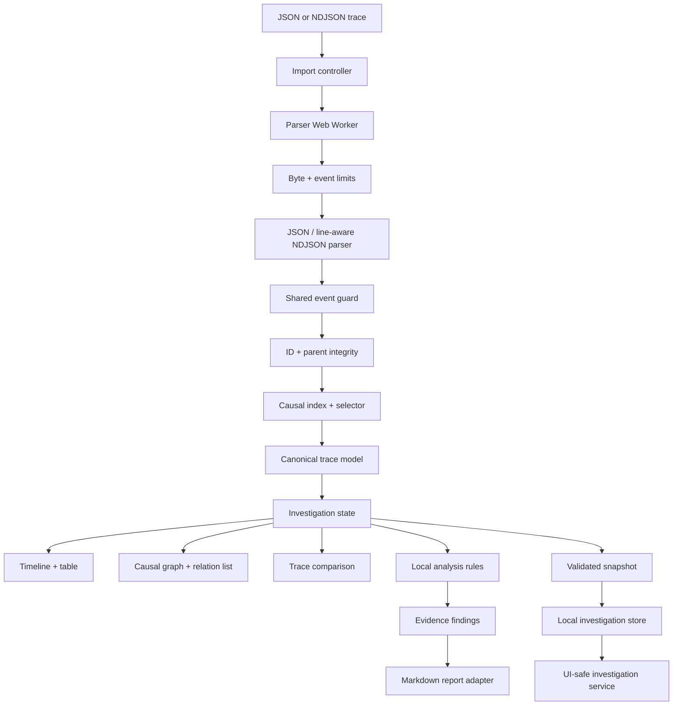
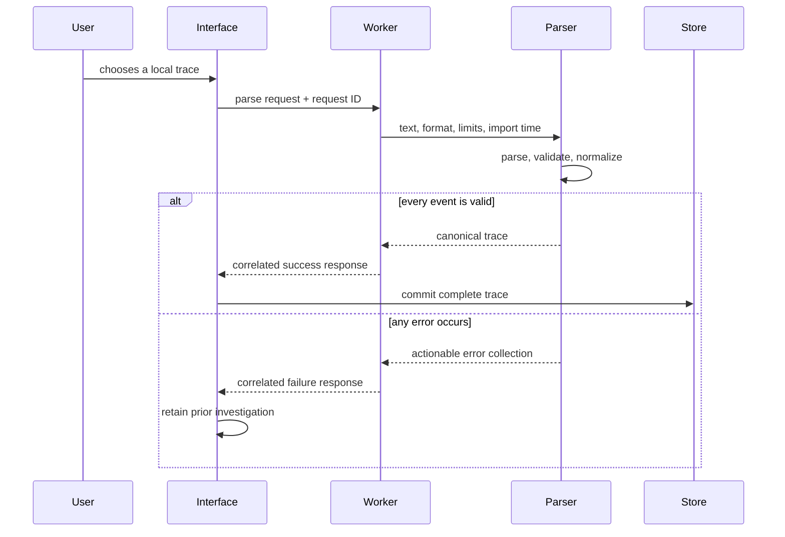

# EventWeave Architecture

> Status: approved and in closeout. This document records the implemented import, analysis, presentation, reporting, and investigation-persistence boundaries plus the remaining product integration points.

## Architecture Goals

- Keep imported telemetry on the user's device.
- Make parsing and analysis deterministic and testable outside React.
- Keep large-file work off the main interface thread.
- Pair every visualization with an accessible textual representation.
- Explain every heuristic so findings remain reviewable engineering evidence.
- Restore saved investigations only after version, trace fingerprint, and session-event identity validation.

## System Design

Parsing, normalization, causal validation, causal-chain selection, worker-backed import state, first-divergence comparison, the accessible timeline explorer, findings, filtering, reporting, snapshot validation, IndexedDB storage, and the investigation service are implemented. Save/restore controls and findings mounting remain closeout integration points.

## Implemented Domain Model

The canonical model separates untrusted imported data from derived analysis:

- `TraceEvent`: stable ID, session identity, timestamp, type, actor, message, duration, outcome, optional parent, and primitive attributes.
- `TraceSession`: identity, start/end time, duration, derived outcome, and ordered event references.
- `TraceRelation`: explicit parent and deterministic within-session sequence edges.
- `NormalizedTrace`: version, import time, sorted events, sessions, and relations.
- `TraceComparison`: ordered event alignments, match basis, confidence, change signals, and the first meaningful divergence.
- `TraceFinding`: stable finding and session IDs, rule kind, severity, transparent explanation, and ordered evidence event IDs.
- `SavedInvestigation`: versioned identity, label, save time, trace fingerprint, session-event selection, and product-neutral filter state.
- `InvestigationSummary` and `RestoredInvestigation`: UI-safe service views that omit fingerprints and serialized payloads.

Imported attributes remain primitive unknown data behind runtime guards. Arbitrary nested telemetry is rejected instead of being trusted through a TypeScript assertion.

## Import and State Flow

The request ID makes stale-result suppression possible without coupling that policy to the worker. The parser has no React, file-system, or browser-storage dependency, so both synchronous tests and worker execution use exactly the same contract.

## Parsing Boundary

The implemented import boundary enforces a 2 MiB file limit and 20,000-event limit before normalization. JSON and NDJSON share one event guard so their contracts cannot drift. NDJSON syntax failures report their source line; all semantic errors identify the event position and stable ID when available.

Validation is transactional: malformed fields, invalid timestamps, negative durations, nested attributes, duplicate IDs, and missing parent references reject the entire import. No partial event list is presented as valid evidence. Events and sessions receive deterministic ordering, including an ID fallback for equal timestamps.

The interface owns file reading, progress feedback, and stale-response policy. Its pure reducer keeps the previous valid trace when a replacement read or parse fails, and request correlation prevents an older reader or worker response from replacing newer evidence. The worker owns only parsing, validation, and normalization.

## Causal Integrity and Selection

An explicit parent relation is accepted only when both events belong to the same session, the parent occurs no later than the child, and following parent links cannot form a cycle. These checks run transactionally with the rest of import validation, so an invalid relation cannot become causal evidence.

The pure causal-chain selector indexes events by ID, walks rootward ancestors, gathers downstream branches, and returns events in normalized trace order. It includes only explicit parent relations. Within-session sequence relations remain useful timeline context but are not promoted to causal claims.

## Visualization and Accessibility

The timeline consumes a pure derived view model rather than calculating geometry in React. It resolves canonical session event references, computes bounded offsets and duration segments, and contains unknown sessions without inventing evidence. Rendered duration segments stay inside their track even when an asynchronous event extends beyond the session's final timestamp.

The interface uses one roving tab stop across timeline event buttons. Arrow keys move to adjacent events, Home and End reach boundaries, and selection synchronizes the timeline, evidence card, causal context, and equivalent semantic table. Table event controls expose their pressed state and target the same evidence region. Downstream causal branches render as a list rather than an arrow-delimited pseudo-chain, avoiding a visual claim that sibling events caused one another.

Color may reinforce latency, outcome, and selection but cannot be the only status signal. Shapes, labels, icons, and accessible descriptions will carry the same meaning. The Day 1 shell already provides visible focus, responsive layout, reduced-motion behavior, and text labels for example states.

## Event Filtering Boundary

Filtering is a pure projection over the selected session's canonical timeline. Exact actor, exact type, outcome, and inclusive minimum-duration predicates compose without mutating the normalized trace or recalculating event geometry. Missing durations do not behave like zero-duration spans, and available actor/type choices are uniquely sorted from the active session.

Presentation remains deliberately separate while the report UI PR is open. Its contract is to use one filter state for both the visual timeline and semantic table, move selection to the first visible event when needed, retain evidence with an explicit note when no events match, and clear filters only when a cross-view jump must reveal a hidden target. The live prototype verified that interaction policy and mobile control sizing before UI wiring was deferred to keep the PR conflict-free.

## Comparison Strategy

Trace comparison aligns one baseline session with one candidate session through a deterministic, order-preserving pass with bounded lookahead. Stable event identifiers receive exact-match priority. When traces use different identifiers, type, actor, normalized label, and relative order provide an explicit semantic fallback; unrelated events stay unmatched instead of being forced into a pair. The bounded window keeps memory linear and runtime proportional to trace size at the 20,000-event import ceiling.

Each alignment exposes its stable-ID, semantic, or unmatched basis and a numeric confidence contribution. Aggregate confidence is reported as high, medium, or low. Meaningful change signals cover type, actor, normalized label, outcome, attributes, missing events, and material timing or duration shifts; wall-clock start time is deliberately ignored. The first changed alignment becomes the first divergence, while every later alignment remains available for a complete comparison view.

The paired checkout fixtures share the same initial actions. Comparison correctly identifies the payment request as the first divergence because the failed trace marks its outcome as failed and its duration grows from 184 ms to 428 ms; later timeout and recovery differences remain ordered evidence rather than obscuring that earlier signal.

## Transparent Finding Rules

The finding engine is a pure, linear pass over normalized sessions. It flags recorded durations at or above a configurable threshold, groups repeated failures only when actor and event type match, and reports a missing completion signal only when a session contains state transitions but no configured completion event type or destination state. This keeps the rules deterministic and product-neutral while allowing an adapter to supply its own completion vocabulary.

Every result has a stable ID, ordered event IDs, severity, and an explanation containing the exact observed value and configured threshold or vocabulary limitation. Findings are review prompts: slow spans do not claim root cause, repeated failures may represent independent attempts, and a missing completion may indicate either an incomplete trace or unfamiliar terminology. The engine does not depend on React, persistence, comparison, or report export, so Lumen can add presentation without duplicating its logic.

The product workflow keeps the current exploration trace as the candidate and imports a second baseline through the same worker-backed validation boundary. Users select one session from each trace, review aggregate confidence and the first divergence, then inspect every alignment in a semantic table. Candidate event controls reuse the timeline selection state so comparison evidence leads back to causal context without duplicating event-detail UI.

## Markdown Report Boundary

The report adapter is a pure deterministic function over the normalized trace, selected session and event, optional comparison, and an injected generation timestamp. It includes explicit causal evidence, the complete session timeline, and active baseline alignment without reading from React or browser APIs. Imported values are collapsed to one line and Markdown-sensitive characters are escaped before they enter headings, lists, or table cells.

The browser layer only turns the returned Markdown into a short-lived object URL and starts a local download. EventWeave revokes that URL immediately and reminds users to review imported telemetry before sharing; export itself never creates a network request.

## Testing Strategy

- Implemented unit tests for JSON/NDJSON parsing, guards, deterministic normalization, size limits, identity integrity, relation integrity, and worker-message validation.
- Planned property-focused tests for ordering, duration, and relation invariants.
- Implemented fixture and focused tests for stable-ID priority, semantic alignment, unmatched insertions, missing sessions, confidence, and the first successful-versus-failed checkout divergence.
- Implemented fixture-backed timeline tests for canonical order, bounded geometry, missing sessions, adjacent keyboard movement, boundary keys, and stale-selection recovery.
- Implemented rule tests proving findings and non-findings, inclusive duration boundaries, repeated-failure grouping, configurable completion vocabulary, stable evidence IDs, and invalid-setting rejection.
- Planned component tests for accessible names, filters, and empty/error states.
- Live browser checks cover successful sample import, roving timeline focus/selection, synchronized causal details, desktop layout, 390 × 844 containment, minimum control sizing, and clean browser logs. Comparison, report export, and expanded browser integration remain planned.

## Decisions

1. The approved week-one schema is product-neutral; external adapters such as OpenTelemetry remain explicit future boundaries.
2. Initial visualizations will be SVG-first and paired with semantic tables. A graph library requires demonstrated interaction value.
3. Initial comparison will align two traces rather than infer a baseline group.
4. Imported event extensions are ignored at the top level, while the documented `attributes` bag remains flat and runtime-validated.

## Lumen handoff to Atlas

- Reviewed Atlas commits: `03959ad` (`feat(eventweave): compare trace session divergence`) and `6060d7f` (`docs(eventweave): record comparison handoff`); the bounded matcher remains UI-independent and identifies the fixture-backed first meaningful divergence.
- Commit: `e264745` (`feat(eventweave): add accessible session timeline`).
- Verification: 26 Vitest tests, strict TypeScript lint, Vite production build, `git diff --check`, a live successful-fixture import, roving arrow-key focus/selection, synchronized causal evidence, clean browser logs, and a 390 × 844 responsive check with no page overflow. Timeline controls measured 70 px high and the session picker measured 46 px.
- Open risks: comparison is not wired into the interface, browser persistence has not begun, and the shared branch still has no remote PR because GitHub publication requires direct user authorization.
- Next distinct task: implement a tested transparent finding engine for slow spans, repeated failures, and missing completion events, returning stable event IDs that the existing explorer can select while leaving findings presentation to Lumen.
