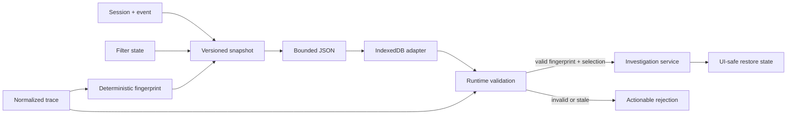

# Investigation Persistence Boundary

EventWeave investigation snapshots are small, versioned JSON values. They record a human label, save time, active session and event IDs, and product-neutral filter state. They deliberately do not embed imported trace contents.

Every snapshot stores a deterministic trace fingerprint derived from schema version plus canonical session/event identity and timestamps. Restore requires the caller to provide the currently loaded normalized trace. A changed trace, missing session-event pair, unsupported snapshot version, malformed value, or payload above 64 KiB is rejected before any state becomes visible.

The fingerprint detects stale data; it is not a security hash and must not be presented as tamper protection. The persistence module stays storage-agnostic. The IndexedDB adapter saves only bounded serialized snapshots, and the investigation service maps validated results into summaries or restore state before React consumes them.

The service injects investigation identity and save time, delegates all storage and validation to the adapter, and exposes save/list/restore/remove methods. List results omit filters and trace fingerprints; restore returns only the validated label, selection, and copied filter state needed for an atomic UI update. Storage and validation errors pass through unchanged, so callers never receive partial restore state.
