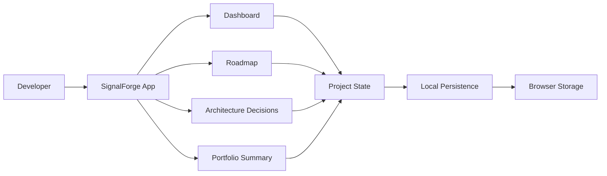
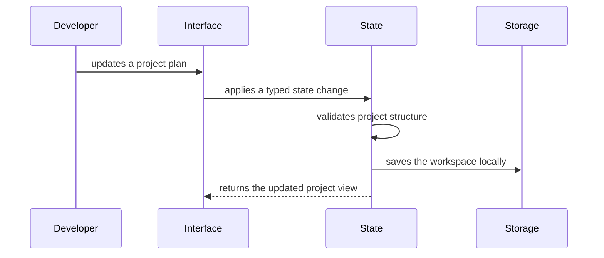

# SignalForge

SignalForge is a local-first planning dashboard for developers who want to turn project ideas into well-structured, portfolio-ready software. It helps connect the parts that usually live in separate places: product purpose, feature scope, architecture decisions, implementation progress, commit notes, and final project storytelling.

The goal is simple: help a developer build projects with enough clarity that the code, documentation, and Git history all explain the same engineering story.

## Problem

Many portfolio projects start with energy but lose shape over time. Requirements drift, architecture decisions are forgotten, commit messages become random, and the final README often gets written after the project is already finished.

SignalForge treats documentation and execution as part of the same workflow. A project begins with a clear brief, grows through feature planning and decision records, and ends with a useful summary that can be reused in a GitHub README, resume note, or portfolio case study.

## Core Features

- Project brief for defining the problem, audience, value, and success criteria.
- Roadmap workspace for breaking work into focused milestones.
- Feature board for tracking planned, active, blocked, and completed work.
- Versioned local persistence with autosave feedback and safe sample reset.
- Commit planner for shaping daily engineering progress into meaningful commit messages.
- Architecture decision records for capturing technical choices and tradeoffs.
- Portfolio summary for collecting highlights, proof points, and final documentation notes.

## Architecture



## Data Flow



## Tech Stack

- React for the user interface.
- TypeScript for predictable application state and safer refactoring.
- Vite for development and build tooling.
- CSS for a custom responsive interface.
- Browser storage for the first local-first version.
- Vitest for state and utility tests as the app logic grows.

## Planned Application Structure

```text
src/
  app/
    App.tsx
    routes.ts
  components/
    AppShell.tsx
    StatusBadge.tsx
    Toolbar.tsx
  features/
    dashboard/
    roadmap/
    decisions/
    summary/
  lib/
    persistence.ts
    project-state.ts
    validation.ts
  styles/
    global.css
```

## Design Principles

- Keep the interface useful on day one, even before external integrations exist.
- Favor clear project evidence over decorative metrics.
- Make project planning feel like engineering work, not administration.
- Keep state local-first so the app remains fast and private.
- Document important tradeoffs as the product evolves.

## Status

SignalForge now has an editable project brief, feature and milestone status controls, debounced browser persistence, save-state feedback, and a safe reset flow. Runtime guards reject malformed or outdated saved data, while pure state helpers keep updates testable and immutable.

The next proof point is custom feature and milestone creation, including validation for useful titles and outcomes.

## Progress Log

| Phase | Date | Completed | Verification | Review |
| --- | --- | --- | --- | --- |
| Foundation | 2026-08-10 | Proposed the architecture, scaffolded the React/TypeScript app, and built the responsive dashboard views. | Production build | Merged on `main` |
| Editable workspace | 2026-08-10 | Added editable brief fields, workflow status controls, versioned local autosave, reset behavior, and state/persistence tests. | 4 Vitest tests, production build, desktop and 390px responsive checks | [PR #1](https://github.com/ASKR04/JavaScript/pull/1) |
