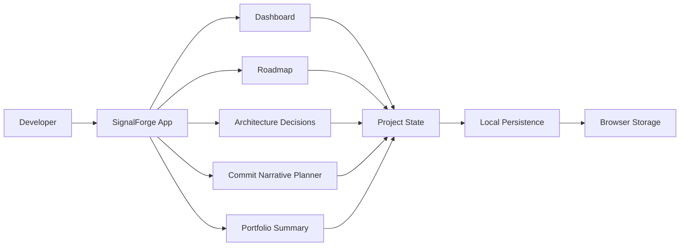
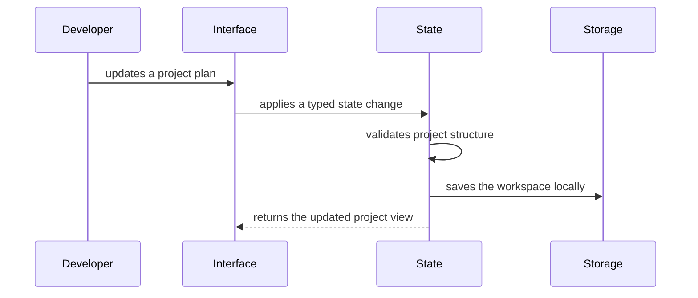

# SignalForge

SignalForge is a local-first planning dashboard for developers who want to turn project ideas into well-structured, portfolio-ready software. It helps connect the parts that usually live in separate places: product purpose, feature scope, architecture decisions, implementation progress, commit notes, and final project storytelling.

The goal is simple: help a developer build projects with enough clarity that the code, documentation, and Git history all explain the same engineering story.

## Problem

Many portfolio projects start with energy but lose shape over time. Requirements drift, architecture decisions are forgotten, commit messages become random, and the final README often gets written after the project is already finished.

SignalForge treats documentation and execution as part of the same workflow. A project begins with a clear brief, grows through feature planning and decision records, and ends with a useful summary that can be reused in a GitHub README, resume note, or portfolio case study.

## Core Features

- Project brief for defining the problem, audience, value, and success criteria.
- Roadmap workspace for breaking work into focused milestones.
- Feature board for tracking planned, active, blocked, and completed work.
- Validated feature and milestone creation with safe, confirmed removal.
- Versioned local persistence with autosave feedback and safe sample reset.
- Multi-tab conflict protection with silent identical-save reconciliation, structural change previews, and explicit resolution.
- Portable JSON workspace backups with schema validation and version-one migration on restore.
- Reversible backup restore and sample reset with conflict-safe undo and redo.
- Commit narrative planner for shaping daily implementation notes into conventional commit messages and durable verification evidence.
- Editable architecture decision records for capturing technical choices and tradeoffs.
- Portfolio summary for collecting highlights, proof points, and final documentation notes.
- Portable Markdown project-story export with completion metrics, safe filenames, clipboard sharing, and local download.
- Portfolio-readiness scoring that surfaces incomplete scope, roadmap, architecture, and delivery evidence before publication.

## Architecture



## Data Flow



## Tech Stack

- React for the user interface.
- TypeScript for predictable application state and safer refactoring.
- Vite for development and build tooling.
- CSS for a custom responsive interface.
- Browser storage for the first local-first version.
- Vitest for state and utility tests as the app logic grows.

## Planned Application Structure

```text
src/
  app/
    App.tsx
    routes.ts
  components/
    AppShell.tsx
    StatusBadge.tsx
    Toolbar.tsx
  features/
    dashboard/
    roadmap/
    decisions/
    summary/
  lib/
    persistence.ts
    project-state.ts
    validation.ts
  styles/
    global.css
```

## Design Principles

- Keep the interface useful on day one, even before external integrations exist.
- Favor clear project evidence over decorative metrics.
- Make project planning feel like engineering work, not administration.
- Keep state local-first so the app remains fast and private.
- Document important tradeoffs as the product evolves.

## Status

SignalForge now supports an editable project brief, custom feature and milestone creation, status controls, confirmed removal, debounced browser persistence, save-state feedback, and a safe reset flow. Its architecture decision log supports validated creation, focused edits, stable human-readable ADR identifiers, and confirmed removal. Creation forms reject incomplete and duplicate records, while roadmap numbering stays coherent after removals.

The portfolio summary now turns live workspace evidence into a structured Markdown case study. Users can download a safe project-specific file or copy the story to their clipboard without sending project data to a server. The export covers the product brief, feature and milestone delivery status, architecture decisions, commit narratives, portfolio highlights, and a generation date.

The commit narrative planner connects daily delivery notes to conventional commit subjects, implementation context, and verification proof. Narratives are validated, saved locally, copyable as ready-to-use commit messages, and included in the project-story export. Existing version-one browser snapshots migrate without losing earlier planning work.

Workspace data can now move safely between browsers or machines through a readable JSON backup. Downloads include format, schema, and export metadata; restores reject unrelated, malformed, incomplete, or future-version files before asking the user to replace local state. Version-one backups migrate through the same tested boundary as browser persistence.

The finished workflow now closes the loop between planning and publication. A tested readiness model checks the project brief, feature delivery, roadmap closure, architecture decisions, and commit evidence. The Summary view presents the result as an accessible progress indicator and actionable checklist before a developer exports the final project story.

Keyboard navigation now includes a first-focus bypass link into the project workspace, high-contrast focus indicators for sidebar navigation and form controls, and a visible focus destination after the bypass. Smooth scrolling and readiness animation are disabled when the operating system requests reduced motion.

Validated creation and editing forms now recover predictably from errors. A live summary announces how many fields need attention, then focus moves to the first invalid control in reading order after its field-level guidance is rendered. Successful feature, milestone, and decision creation returns focus to the first field for efficient repeated entry.

Local persistence now protects edits that are still inside the autosave debounce window. A shared coordinator coalesces rapid changes, reports storage failures through the existing save status, and flushes the newest pending workspace when the page is hidden so a quick tab close or navigation does not discard the last input.

Transient browser-storage failures are now recoverable without forcing another edit. The coordinator retains only the newest failed workspace in memory, exposes a visible retry action, and attempts the retained save again during a later page lifecycle flush. Successful newer edits clear stale recovery state so an older snapshot cannot overwrite current work.

Multiple open SignalForge tabs no longer overwrite one another silently. A validated save from another tab pauses the current tab's pending autosave and presents an accessible choice to load the external workspace or keep and re-save the current one. Further edits remain in memory and cannot restart persistence while that choice is unresolved, closing a race that could otherwise overwrite the external snapshot. Storage-event order—not the writer's wall clock—determines the latest observed value, so clock skew cannot hide a write that already replaced durable browser data. Identical workspace content is reconciled without an unnecessary prompt, while genuine conflicts summarize changed brief fields and added, removed, or updated records without exposing their contents. Malformed and unsupported snapshots never reach the interface.

Backup restore and sample reset are now reversible workspace replacements. Each operation dismisses an obsolete multi-tab prompt, saves through the same retryable autosave boundary as ordinary edits, and retains both workspace versions for undo or redo until another replacement or page refresh. This removes the gap where a stale conflict choice could overwrite a newly restored workspace.

Unreadable browser data is now a recoverable startup state instead of looking like an empty workspace. SignalForge preserves the original stored value, pauses autosave, offers an exact raw rescue download, warns before navigation, and requires a validated restore or explicit confirmation before replacing storage. Valid and genuinely empty workspaces keep their existing startup behavior.

Unavailable browser storage is also explicit at startup. A lazy adapter contains failures from both resolving the browser storage API and calling it, so privacy modes and sandboxed contexts cannot crash the application before recovery appears. The toolbar identifies the workspace as temporary, offers an immediate storage probe that re-resolves access, and keeps local backup download available. Once work changes, a shared exit policy warns while persistence is pending, failed, conflicted, or paused for unreadable-data recovery, preventing an unacknowledged close from discarding the only in-memory copy.

## Retrospective

SignalForge began as a static planning dashboard and finished as a private, portable workspace with explicit boundaries between typed domain logic, React interaction code, browser persistence, and export adapters. The most effective decision was keeping validation and state transitions framework-independent: this made features such as backup migration, story export, and readiness scoring straightforward to test without browser mocks.

The week also exposed a useful product lesson. Capturing evidence is not the same as knowing work is ready to publish. The final readiness checklist turns the data already present in the workspace into a clear release decision, rather than adding another disconnected form. A future version could replace browser storage with an optional synchronized adapter, but the local-first core is complete and useful without accounts or external services.

## Progress Log

| Phase | Date | Completed | Verification | Review |
| --- | --- | --- | --- | --- |
| Foundation | 2026-08-10 | Proposed the architecture, scaffolded the React/TypeScript app, and built the responsive dashboard views. | Production build | Merged on `main` |
| Editable workspace | 2026-08-10 | Added editable brief fields, workflow status controls, versioned local autosave, reset behavior, and state/persistence tests. | 4 Vitest tests, production build, desktop and 390px responsive checks | [PR #1](https://github.com/ASKR04/JavaScript/pull/1) |
| Plan composition | 2026-08-11 | Added validated feature and milestone creation, stable IDs, confirmed removal, and automatic roadmap resequencing. | 6 Vitest tests, production build, 1440px desktop and 390px responsive checks | [PR #1](https://github.com/ASKR04/JavaScript/pull/1) |
| Decision log | 2026-08-12 | Added validated ADR creation, editable decision cards, stable ADR sequences, confirmed removal, and autosaved immutable state transitions. | 8 Vitest tests, production build, 1440px desktop and 390px interaction checks | [PR #1](https://github.com/ASKR04/JavaScript/pull/1) |
| Project story export | 2026-08-13 | Added deterministic Markdown generation, live evidence metrics, safe filenames, browser download, clipboard sharing, and accessible feedback. | 11 Vitest tests, production build, 1440px desktop and 390px responsive interaction checks | [PR #1](https://github.com/ASKR04/JavaScript/pull/1) |
| Commit narrative planner | 2026-08-14 | Added conventional commit composition, subject-length guidance, implementation and verification evidence, version-one storage migration, clipboard handoff, and project-story integration. | 14 Vitest tests, production build, desktop and mobile responsive checks | [PR #1](https://github.com/ASKR04/JavaScript/pull/1) |
| Workspace portability | 2026-08-15 | Added readable JSON backup downloads, validated restore confirmation, shared schema migration, safe filenames, and accessible transfer feedback. | 20 Vitest tests, production build, desktop and 390px restore interaction checks | [PR #1](https://github.com/ASKR04/JavaScript/pull/1) |
| Portfolio closeout | 2026-08-17 | Added pure readiness scoring, an accessible completion checklist, final responsive polish, finished-workflow documentation, and the EventWeave proposal. | 24 Vitest tests, production build, local-server smoke check, and responsive CSS/accessibility review | [PR #3](https://github.com/ASKR04/JavaScript/pull/3) |
| Accessibility maintenance | 2026-08-18 | Added a keyboard bypass path, visible navigation and control focus states, and reduced-motion behavior. | 24 Vitest tests, production build, and source-level accessibility review | [PR #4](https://github.com/ASKR04/JavaScript/pull/4) |
| Validation recovery | 2026-08-19 | Added ordered first-error focus recovery and live error-count summaries across feature, milestone, decision, and commit forms. | 27 Vitest tests, production build, HTTP smoke check, and semantic source review | [PR #4](https://github.com/ASKR04/JavaScript/pull/4) |
| Autosave resilience | 2026-08-20 | Added coalesced save scheduling and lifecycle flushing so pending edits survive quick tab exits. | 30 Vitest tests, production build, lifecycle unit coverage, and HTTP 200 smoke check | [PR #4](https://github.com/ASKR04/JavaScript/pull/4) |
| Autosave recovery | 2026-08-21 | Retained the newest failed local save for explicit or lifecycle retry without allowing stale recovery data to overwrite later edits. | 32 Vitest tests, production build, recovery unit coverage, and HTTP smoke check | [PR #4](https://github.com/ASKR04/JavaScript/pull/4) |
| Multi-tab conflict protection | 2026-08-24 | Paused pending local writes when a newer validated external save arrives and added explicit load-or-keep recovery actions. | 35 Vitest tests, production build, two-tab browser interaction check, desktop visual review, and mobile CSS review | [PR #4](https://github.com/ASKR04/JavaScript/pull/4) |
| Tab conflict review | 2026-08-24 | Reconciled identical external saves without interruption, summarized genuine conflicts, and contained the alert at the mobile breakpoint. | 38 Vitest tests, production build, live identical/conflicting two-tab checks, and 390x844 responsive measurement | [PR #4](https://github.com/ASKR04/JavaScript/pull/4) |
| Reversible workspace replacement | 2026-08-25 | Routed restore/reset through recoverable autosave, dismissed stale conflicts, and added persistent undo/redo recovery. | 41 Vitest tests, production build, 390x844 workspace measurement, responsive notice source review, and browser console review | [PR #4](https://github.com/ASKR04/JavaScript/pull/4) |
| Unreadable startup recovery | 2026-08-26 | Distinguished empty, valid, unavailable, and invalid storage; preserved raw unreadable data; and required explicit recovery before autosave resumes. | 43 Vitest tests, production build, normal-startup browser smoke check, 390x844 overflow measurement, and recovery UI source review | [PR #4](https://github.com/ASKR04/JavaScript/pull/4) |
| Temporary workspace protection | 2026-08-27 | Exposed unavailable browser storage, added an immediate save probe, and protected pending, failed, conflicted, or recovery-paused work before exit. | 49 Vitest tests, production build, desktop browser smoke check, 390x844 no-overflow measurement, clean browser console, and temporary-state source review | [PR #4](https://github.com/ASKR04/JavaScript/pull/4) |
| Storage access containment | 2026-08-30 | Lazily resolved browser storage so getter-level access denial becomes a recoverable temporary workspace and later probes can retry the full access boundary. | 51 Vitest tests, production build, storage-boundary unit coverage, and browser smoke check | [PR #4](https://github.com/ASKR04/JavaScript/pull/4) |
| Conflict-safe continued editing | 2026-08-31 | Kept autosave paused when the current tab changes during an unresolved external-save conflict and clarified the in-memory editing state. | 53 Vitest tests, production build, two-tab browser check, and responsive source review | [PR #4](https://github.com/ASKR04/JavaScript/pull/4) |
| Clock-safe tab synchronization | 2026-09-01 | Reconciled valid external writes by observed browser-event order so slow or corrected clocks cannot hide durable cross-tab replacements. | 54 Vitest tests, production build, live two-tab latest-write check, 390px containment measurement, and clean browser logs | [PR #4](https://github.com/ASKR04/JavaScript/pull/4) |
