# SignalForge Architecture

## Product Summary

SignalForge is a local-first dashboard for planning and proving advanced software projects. It is designed for engineers who want every project to have a clear purpose, visible architecture, a strong commit story, and reusable portfolio documentation.

This is not a copied tutorial project. The idea combines project planning, architecture review, commit narrative design, and portfolio evidence into one developer-focused workflow.

## Target Users

- Software engineers building public GitHub portfolio projects.
- Students moving beyond toy examples into useful applications.
- Developers who want each commit to show intentional product and engineering progress.

## Core Features

- Project brief: define audience, problem, value, and success criteria.
- Weekly roadmap: plan seven days of scoped engineering progress.
- Feature board: track planned, active, blocked, and completed features.
- Commit planner: convert daily progress into clear commit messages and proof points.
- Architecture decisions: record technical choices, alternatives, and consequences.
- Portfolio summary: generate documentation-ready project highlights.

## Initial Technical Architecture

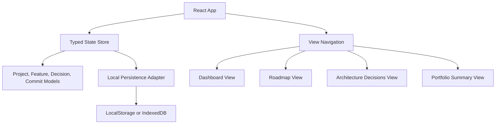

## State Flow

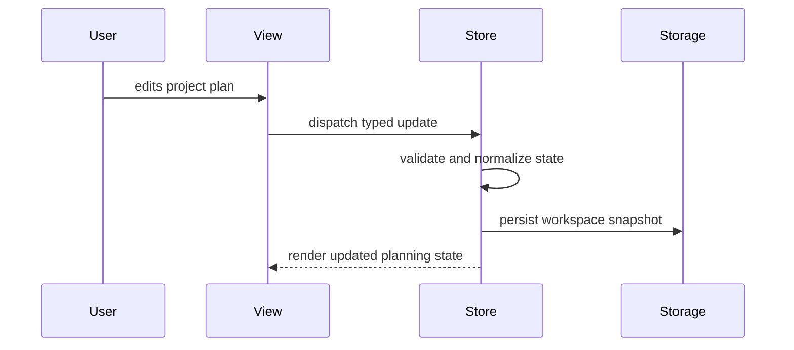

## Implemented Persistence Boundary

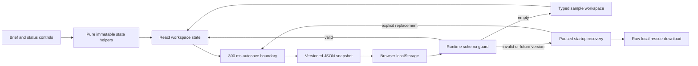

The persistence adapter is deliberately small and browser-native. Each snapshot includes a schema version and timestamp. Loading is defensive: valid data, empty storage, unreadable data, and unavailable storage are separate typed outcomes. Invalid JSON, future versions, or malformed project records cannot break application startup, but they are no longer treated like an empty workspace and silently overwritten. The adapter accepts narrow storage interfaces so its behavior can be tested without a browser environment.

State changes are implemented as pure functions keyed by stable feature and roadmap IDs. This prevents accidental mutation, makes status changes predictable, and keeps the UI independent from future storage adapters.

## Unreadable Startup Recovery Flow

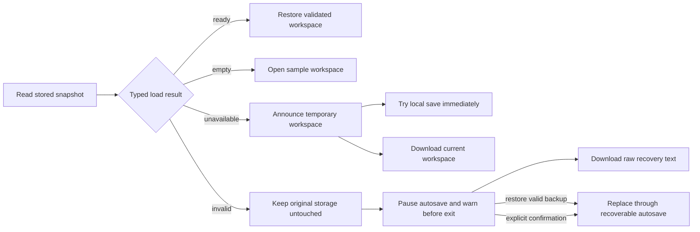

Startup recovery favors reversibility over guessing. The app renders a usable in-memory sample while preserving the unreadable browser value, clearly announces that autosave is paused, and warns before navigation. The developer can download the exact raw value for manual repair, restore a validated backup through the existing migration boundary, or explicitly replace storage with the workspace currently shown. Unavailable storage instead produces a temporary-workspace warning with an immediate persistence probe and a portable backup path. Normal empty and valid startup paths do not display recovery controls.

## Workspace Exit Protection

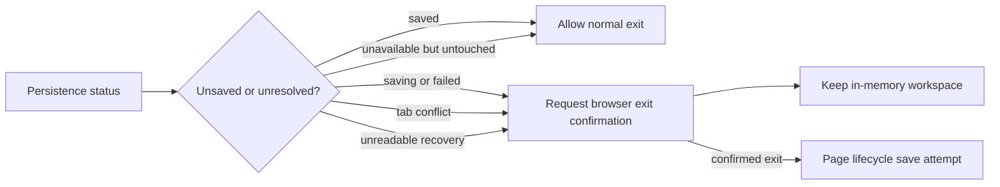

The exit decision is derived from the same persistence status shown in the toolbar. An untouched temporary sample can close normally, while the first workspace mutation moves through `saving` and activates protection before the debounce finishes. Save failures, unresolved cross-tab choices, and unreadable-data recovery remain protected until the user reaches a durable `saved` state or explicitly accepts navigation.

## Plan Composition Flow

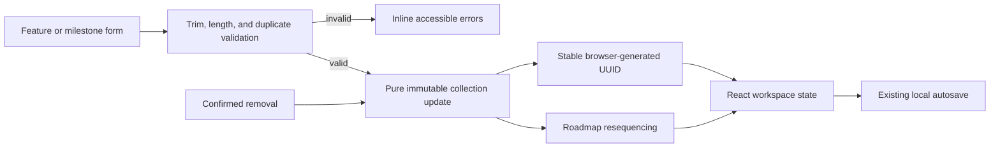

Feature and milestone forms share a focused composer component while domain validation remains framework-independent. Mutations return validation errors alongside the next workspace so invalid changes never reach persistence. Milestone removal also derives new display sequences from list order, avoiding gaps without changing stable record IDs.

## Architecture Decision Workflow

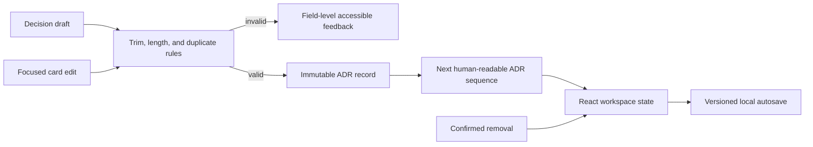

Architecture decisions use the same pure mutation boundary as features and milestones, but retain their domain-specific fields: title, context, and consequence. Creation derives the next `ADR-###` identifier from the active log, while edits preserve the record identifier. Validation excludes the current record during edits so a title may remain unchanged, while still preventing ambiguous duplicate decisions elsewhere in the log.

Each decision card keeps an isolated draft until the user saves it. This prevents incomplete typing from entering shared workspace state and provides a clear boundary for validation feedback. Successful updates then flow through the existing debounced persistence adapter without adding browser concerns to the decision UI.

## Project Story Export Flow

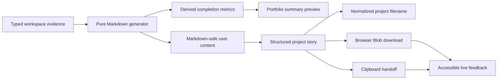

Export generation is deliberately framework-independent. A pure function receives the current typed workspace and an optional date, then produces deterministic Markdown containing the product snapshot, delivery evidence, feature scope, roadmap, decisions, and portfolio highlights. Tests can therefore verify the full artifact without mocking browser APIs.

The React summary view owns only the delivery adapters: it derives evidence metrics for the interface, creates a short-lived browser Blob for download, and requests clipboard access for quick sharing. Project names are normalized into safe filenames, while Markdown control characters in editable workspace fields are escaped so user content cannot accidentally corrupt the generated document structure. No export data crosses a network boundary.

## Commit Narrative Workflow

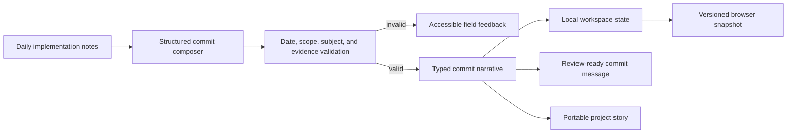

Commit narratives preserve three distinct kinds of evidence: a conventional subject that summarizes the change, an implementation note that explains the meaningful work, and a verification note that records tests, reviews, or measurable outcomes. Subject previews enforce the 72-character commit convention before records enter shared state.

The persistence boundary now writes version-two snapshots containing commit narratives. A narrow version-one migration restores earlier project planning data and initializes an empty narrative collection, so adding the feature does not silently discard an existing local workspace.

## Portable Workspace Transfer

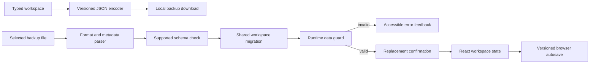

Backups use a recognizable format identifier, workspace schema version, ISO export timestamp, and the full typed workspace. The pure parser distinguishes malformed JSON, unrelated documents, unsupported future versions, invalid metadata, and incomplete domain data so the interface can explain why a file was rejected without exposing parsing details.

Restore and local persistence share one migration function. Version-one data gains an empty commit narrative collection before it reaches the runtime guard, while version-two data must satisfy the complete current model. The toolbar owns only browser file and download adapters; React state changes only after parsing succeeds and the user confirms replacement.

## Portfolio Readiness Flow

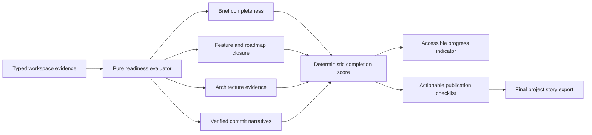

Readiness is derived rather than persisted. The evaluator receives a workspace and returns five evidence checks, a completed count, a percentage, and a final ready flag. Empty collections never count as delivered, while text evidence must contain non-whitespace content. Keeping this logic pure prevents the publication signal from drifting away from the live workspace and makes edge cases independently testable.

The Summary view exposes the result through a labelled progressbar and a semantic checklist. Status is not communicated by color alone: every check includes an icon, explicit text, and guidance for the next action. The layout collapses from two columns to one on narrow screens without changing reading order.

## Validation Recovery Flow

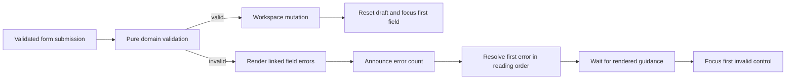

The reusable focus coordinator accepts an explicit field order, validation errors, and focus targets. It schedules focus after React renders updated `aria-invalid` and `aria-describedby` attributes, ensuring the destination and its guidance are available together. The coordinator is independent of form markup and has focused tests for reading order, unavailable targets, and valid submissions; the shared summary keeps visible and announced feedback consistent across planning, decision, and commit workflows.

## Lifecycle-Safe Autosave Flow

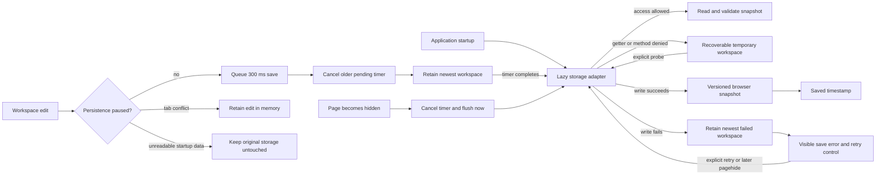

The autosave coordinator owns scheduling rather than React components. Rapid updates replace the pending timer and retain only the newest immutable workspace. A pure pause policy prevents new timers from being scheduled while unreadable startup data or an unresolved external-save conflict must remain untouched. The current tab can continue accepting edits during a conflict, but those edits stay in memory until the developer explicitly keeps the tab or loads the other snapshot. A `pagehide` lifecycle listener flushes pending values synchronously through the existing storage boundary before navigation, tab close, or mobile backgrounding can interrupt the debounce window.

If browser storage rejects a write, the coordinator keeps that workspace in memory and exposes an explicit retry through the toolbar. A later lifecycle flush also retries the retained value, while any newer queued edit supersedes it. Successful persistence clears recovery state, preventing an older failed snapshot from overwriting newer work. Scheduling, flush behavior, recovery, and stale-state replacement are covered without browser timing mocks.

Browser storage is resolved lazily at each read or write instead of being accessed while React initializes. This contains security errors raised by the `localStorage` property getter itself, not only errors from `getItem` or `setItem`, and lets an explicit retry probe re-resolve the complete browser boundary if access later becomes available.

## Multi-Tab Conflict Flow

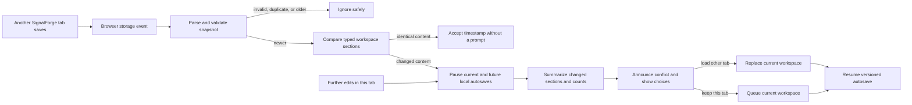

The storage-event boundary never applies an external value directly. It first uses the same version, timestamp, migration, and domain guards as startup persistence, then compares the candidate with the current saved timestamp and typed workspace. A newer snapshot with identical content advances the local timestamp and cancels the redundant pending write without interrupting the user. A genuinely different save pauses this tab's pending write and every later edit until the developer makes an explicit choice, preventing a subsequent keystroke from silently reactivating last-writer-wins behavior.

Conflict previews disclose structure rather than sensitive content. A pure comparison reports changed brief-field counts and added, removed, or updated records across features, roadmap milestones, architecture decisions, and commit narratives. Loading an already-persisted snapshot skips one autosave cycle, preventing a conflict from bouncing back to the original tab. The alert uses semantic list markup, non-color text, keyboard-accessible actions, and responsive wrapping rules.

## Reversible Workspace Replacement Flow

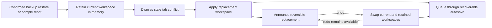

Whole-workspace replacement uses the same recoverable autosave path as normal edits instead of removing the stored snapshot first. Starting a restore or reset cancels pending writes and dismisses any older multi-tab prompt so a stale external choice cannot replace the newly selected workspace. A pure swap model retains both sides of the operation for repeatable undo and redo until another replacement or page refresh; its persistent button keeps keyboard focus stable while the live description reports the current state.

## Proposed Folder Structure

```text
signalforge/
  src/
    app/
      App.tsx
      routes.ts
    components/
      AppShell.tsx
      StatusBadge.tsx
      Toolbar.tsx
  features/
    commits/CommitPlanner.tsx         # validated commit evidence composer and clipboard handoff
      dashboard/
      roadmap/
      decisions/
      summary/
    lib/
      persistence.ts
      project-state.ts
      validation.ts
    styles/
      global.css
  tests/
  README.md
```

## Engineering Standards

- Keep components focused and composable.
- Separate state logic from visual components.
- Use accessible labels, keyboard-friendly controls, and responsive layout rules.
- Add tests for state transitions and validation once the state model exists.
- Keep documentation current with each major feature commit.

## Current Implementation Map

```text
src/
  app/App.tsx                         # workspace ownership, autosave and storage-event lifecycle,
                                      # and keyboard bypass destination
  components/WorkspaceToolbar.tsx    # save, transfer, startup recovery, conflict, and reset controls
  components/WorkItemComposer.tsx    # reusable accessible creation form
  components/ValidationSummary.tsx   # shared live error-count feedback
  features/dashboard/                # brief editor and feature workflow controls
  features/roadmap/Roadmap.tsx       # milestone workflow controls
  features/decisions/Decisions.tsx   # validated ADR creation and editing
  features/summary/Summary.tsx       # evidence metrics and browser export actions
  lib/portfolio-readiness.ts          # pure publication evidence evaluator
  lib/portfolio-readiness.test.ts     # incomplete, complete, and empty-state coverage
  lib/project-state.ts                # typed models and starter workspace
  lib/project-story.ts                # pure Markdown export and filename helpers
  lib/project-story.test.ts           # deterministic export coverage
  lib/workspace-backup.ts             # portable encoder, parser, filename, and migration boundary
  lib/workspace-backup.test.ts        # current, legacy, invalid, and future-format coverage
  lib/workspace-state.ts              # immutable state transitions
  lib/focus-validation.ts             # ordered post-render invalid-field focus
  lib/focus-validation.test.ts        # focus scheduling and fallback coverage
  lib/workspace-autosave.ts           # pause policy, coalesced saves, and lifecycle flush boundary
  lib/workspace-autosave.test.ts      # pause, scheduling, flush, and storage-error coverage
  lib/workspace-exit-protection.ts    # pure unsaved-state exit warning policy
  lib/workspace-exit-protection.test.ts # pending, failed, conflict, and recovery coverage
  lib/workspace-replacement.ts        # reversible restore/reset swap model
  lib/workspace-replacement.test.ts   # undo, redo, and repeat-toggle coverage
  lib/workspace-sync.ts               # validated external-save classification and structural summaries
  lib/workspace-sync.test.ts          # reconciliation, conflict-summary, and invalid snapshot coverage
  lib/persistence.ts                  # typed startup outcomes, versioned storage adapter, and guards
  lib/workspace-state.test.ts         # transition, migration, and startup recovery tests
  styles/global.css                   # responsive layout, focus visibility, and reduced-motion rules
```

## Approval and Delivery State

The approved SignalForge week is complete. The final increment adds derived portfolio-readiness guidance, closes the responsive and accessibility review, documents the finished workflow, and records the project retrospective. Further SignalForge work should be treated as maintenance or a separately approved enhancement rather than an extension of the original weekly scope.

Post-closeout maintenance on 2026-08-18 strengthened the application shell without expanding product scope. The first keyboard stop now bypasses the persistent navigation and moves focus to the labelled workspace, interactive focus rings remain visible against both dark and light surfaces, and motion preferences control scrolling and progress transitions.

The 2026-08-19 maintenance increment improves error recovery without adding product scope. Every domain-validated composer now presents a live error count and returns focus to the first invalid control in declared reading order after React renders its linked guidance.

The 2026-08-20 maintenance increment protects the local-first contract at the page lifecycle boundary. Debounced changes are coalesced through a tested coordinator, and the newest pending workspace is flushed when the page is hidden.

The 2026-08-21 maintenance increment makes transient storage failures recoverable. Failed writes retain the newest workspace in memory for an explicit or lifecycle retry, and newer edits safely replace stale recovery state.

The 2026-08-24 maintenance increment prevents silent multi-tab overwrites. Valid newer external snapshots pause local autosave and present explicit load-or-keep actions; stale, duplicate, malformed, and unsupported snapshots are ignored.

The follow-up 2026-08-24 maintenance increment removes false conflict prompts for identical newer saves and gives genuine conflicts a privacy-preserving summary of the workspace sections and record counts that differ. The narrow-screen toolbar disables column wrapping and gives the alert an explicit contained width so its semantic summary and 44 px actions remain inside a 390 px viewport.

The 2026-08-25 maintenance increment makes destructive whole-workspace replacement reversible. Backup restore and sample reset now dismiss stale tab conflicts, persist through the recoverable autosave coordinator, and retain an in-memory undo/redo workspace until another replacement or page refresh.

The 2026-08-26 maintenance increment protects unreadable startup data from silent replacement. Malformed, incomplete, and future-version snapshots pause autosave, remain available as an exact raw rescue download, and require a validated restore or explicit confirmation before browser storage is replaced.

The 2026-08-27 maintenance increment makes temporary work visible when browser storage cannot be read. An immediate save probe can recover access without requiring an edit, and a shared exit policy protects pending, failed, conflicted, and recovery-paused workspace state from an unacknowledged close.

The 2026-08-30 maintenance increment contains storage access at the property boundary. SignalForge now converts both getter-level and method-level denial into its recoverable temporary-workspace state, while every explicit retry re-resolves access instead of retaining a permanently failed handle.

The 2026-08-31 maintenance increment closes a multi-tab overwrite race. Once a newer external snapshot creates a conflict, later edits remain usable in memory but cannot restart autosave until the developer explicitly chooses which tab to keep.
