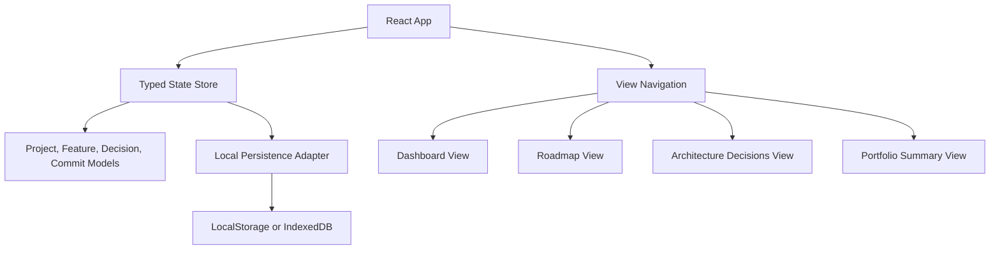
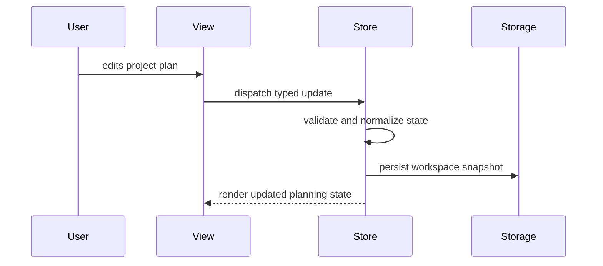
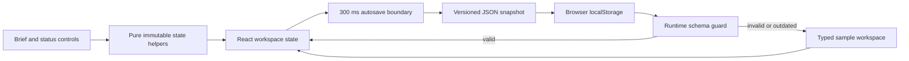
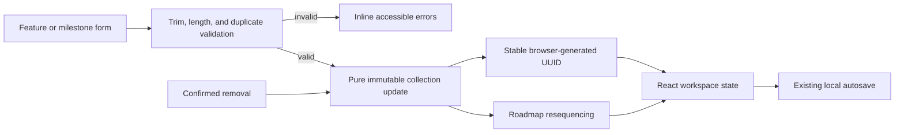
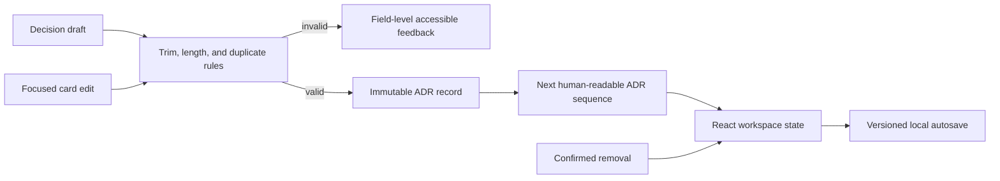
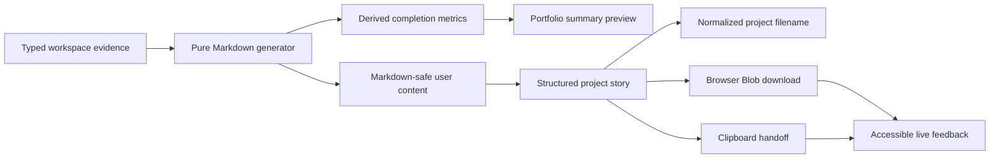
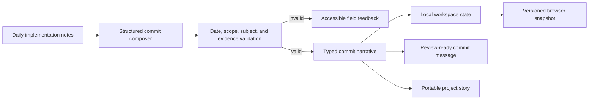
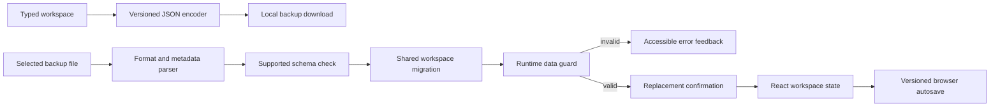
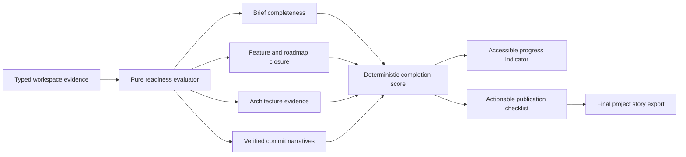

# SignalForge Architecture

## Product Summary

SignalForge is a local-first dashboard for planning and proving advanced software projects. It is designed for engineers who want every project to have a clear purpose, visible architecture, a strong commit story, and reusable portfolio documentation.

This is not a copied tutorial project. The idea combines project planning, architecture review, commit narrative design, and portfolio evidence into one developer-focused workflow.

## Target Users

- Software engineers building public GitHub portfolio projects.
- Students moving beyond toy examples into useful applications.
- Developers who want each commit to show intentional product and engineering progress.

## Core Features

- Project brief: define audience, problem, value, and success criteria.
- Weekly roadmap: plan seven days of scoped engineering progress.
- Feature board: track planned, active, blocked, and completed features.
- Commit planner: convert daily progress into clear commit messages and proof points.
- Architecture decisions: record technical choices, alternatives, and consequences.
- Portfolio summary: generate documentation-ready project highlights.

## Initial Technical Architecture



## State Flow



## Implemented Persistence Boundary



The persistence adapter is deliberately small and browser-native. Each snapshot includes a schema version and timestamp. Loading is defensive: invalid JSON, outdated versions, or malformed project records are ignored rather than allowed to break application startup. The adapter accepts narrow storage interfaces so its behavior can be tested without a browser environment.

State changes are implemented as pure functions keyed by stable feature and roadmap IDs. This prevents accidental mutation, makes status changes predictable, and keeps the UI independent from future storage adapters.

## Plan Composition Flow



Feature and milestone forms share a focused composer component while domain validation remains framework-independent. Mutations return validation errors alongside the next workspace so invalid changes never reach persistence. Milestone removal also derives new display sequences from list order, avoiding gaps without changing stable record IDs.

## Architecture Decision Workflow



Architecture decisions use the same pure mutation boundary as features and milestones, but retain their domain-specific fields: title, context, and consequence. Creation derives the next `ADR-###` identifier from the active log, while edits preserve the record identifier. Validation excludes the current record during edits so a title may remain unchanged, while still preventing ambiguous duplicate decisions elsewhere in the log.

Each decision card keeps an isolated draft until the user saves it. This prevents incomplete typing from entering shared workspace state and provides a clear boundary for validation feedback. Successful updates then flow through the existing debounced persistence adapter without adding browser concerns to the decision UI.

## Project Story Export Flow



Export generation is deliberately framework-independent. A pure function receives the current typed workspace and an optional date, then produces deterministic Markdown containing the product snapshot, delivery evidence, feature scope, roadmap, decisions, and portfolio highlights. Tests can therefore verify the full artifact without mocking browser APIs.

The React summary view owns only the delivery adapters: it derives evidence metrics for the interface, creates a short-lived browser Blob for download, and requests clipboard access for quick sharing. Project names are normalized into safe filenames, while Markdown control characters in editable workspace fields are escaped so user content cannot accidentally corrupt the generated document structure. No export data crosses a network boundary.

## Commit Narrative Workflow



Commit narratives preserve three distinct kinds of evidence: a conventional subject that summarizes the change, an implementation note that explains the meaningful work, and a verification note that records tests, reviews, or measurable outcomes. Subject previews enforce the 72-character commit convention before records enter shared state.

The persistence boundary now writes version-two snapshots containing commit narratives. A narrow version-one migration restores earlier project planning data and initializes an empty narrative collection, so adding the feature does not silently discard an existing local workspace.

## Portable Workspace Transfer



Backups use a recognizable format identifier, workspace schema version, ISO export timestamp, and the full typed workspace. The pure parser distinguishes malformed JSON, unrelated documents, unsupported future versions, invalid metadata, and incomplete domain data so the interface can explain why a file was rejected without exposing parsing details.

Restore and local persistence share one migration function. Version-one data gains an empty commit narrative collection before it reaches the runtime guard, while version-two data must satisfy the complete current model. The toolbar owns only browser file and download adapters; React state changes only after parsing succeeds and the user confirms replacement.

## Portfolio Readiness Flow



Readiness is derived rather than persisted. The evaluator receives a workspace and returns five evidence checks, a completed count, a percentage, and a final ready flag. Empty collections never count as delivered, while text evidence must contain non-whitespace content. Keeping this logic pure prevents the publication signal from drifting away from the live workspace and makes edge cases independently testable.

The Summary view exposes the result through a labelled progressbar and a semantic checklist. Status is not communicated by color alone: every check includes an icon, explicit text, and guidance for the next action. The layout collapses from two columns to one on narrow screens without changing reading order.

## Proposed Folder Structure

```text
signalforge/
  src/
    app/
      App.tsx
      routes.ts
    components/
      AppShell.tsx
      StatusBadge.tsx
      Toolbar.tsx
  features/
    commits/CommitPlanner.tsx         # validated commit evidence composer and clipboard handoff
      dashboard/
      roadmap/
      decisions/
      summary/
    lib/
      persistence.ts
      project-state.ts
      validation.ts
    styles/
      global.css
  tests/
  README.md
```

## Engineering Standards

- Keep components focused and composable.
- Separate state logic from visual components.
- Use accessible labels, keyboard-friendly controls, and responsive layout rules.
- Add tests for state transitions and validation once the state model exists.
- Keep documentation current with each major feature commit.

## Current Implementation Map

```text
src/
  app/App.tsx                         # workspace ownership and autosave lifecycle
  components/WorkspaceToolbar.tsx    # save feedback, portable transfer, and reset controls
  components/WorkItemComposer.tsx    # reusable accessible creation form
  features/dashboard/                # brief editor and feature workflow controls
  features/roadmap/Roadmap.tsx       # milestone workflow controls
  features/decisions/Decisions.tsx   # validated ADR creation and editing
  features/summary/Summary.tsx       # evidence metrics and browser export actions
  lib/portfolio-readiness.ts          # pure publication evidence evaluator
  lib/portfolio-readiness.test.ts     # incomplete, complete, and empty-state coverage
  lib/project-state.ts                # typed models and starter workspace
  lib/project-story.ts                # pure Markdown export and filename helpers
  lib/project-story.test.ts           # deterministic export coverage
  lib/workspace-backup.ts             # portable encoder, parser, filename, and migration boundary
  lib/workspace-backup.test.ts        # current, legacy, invalid, and future-format coverage
  lib/workspace-state.ts              # immutable state transitions
  lib/persistence.ts                  # versioned storage adapter and guards
  lib/workspace-state.test.ts         # transition and persistence tests
```

## Approval and Delivery State

The approved SignalForge week is complete. The final increment adds derived portfolio-readiness guidance, closes the responsive and accessibility review, documents the finished workflow, and records the project retrospective. Further SignalForge work should be treated as maintenance or a separately approved enhancement rather than an extension of the original weekly scope.
