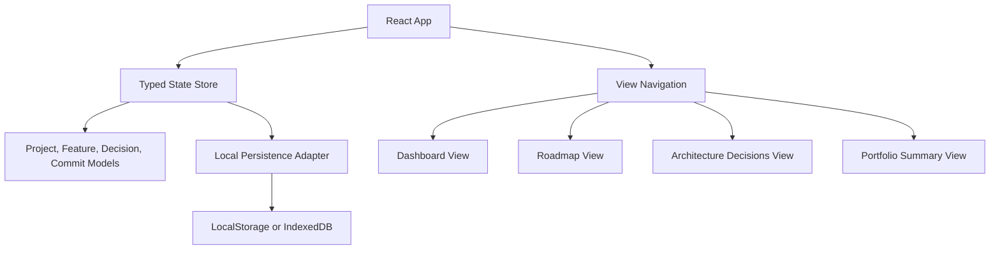
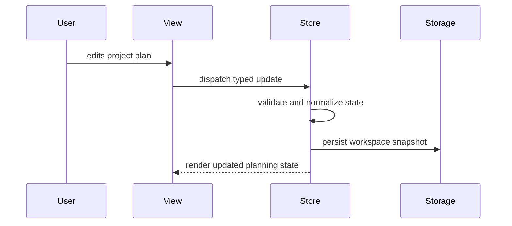
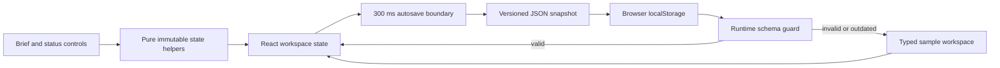
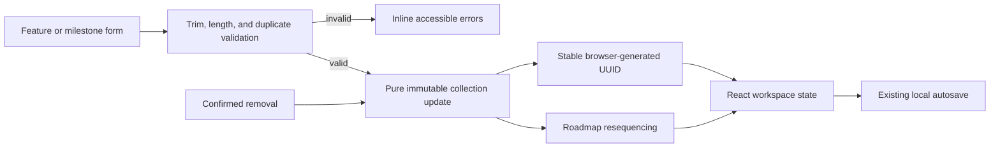
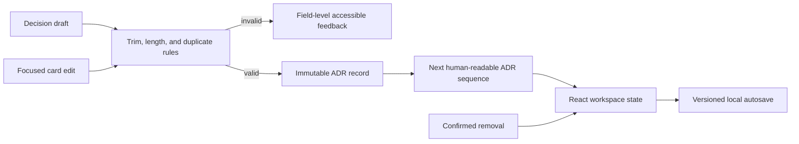

# SignalForge Architecture

## Product Summary

SignalForge is a local-first dashboard for planning and proving advanced software projects. It is designed for engineers who want every project to have a clear purpose, visible architecture, a strong commit story, and reusable portfolio documentation.

This is not a copied tutorial project. The idea combines project planning, architecture review, commit narrative design, and portfolio evidence into one developer-focused workflow.

## Target Users

- Software engineers building public GitHub portfolio projects.
- Students moving beyond toy examples into useful applications.
- Developers who want each commit to show intentional product and engineering progress.

## Core Features

- Project brief: define audience, problem, value, and success criteria.
- Weekly roadmap: plan seven days of scoped engineering progress.
- Feature board: track planned, active, blocked, and completed features.
- Commit planner: convert daily progress into clear commit messages and proof points.
- Architecture decisions: record technical choices, alternatives, and consequences.
- Portfolio summary: generate documentation-ready project highlights.

## Initial Technical Architecture



## State Flow



## Implemented Persistence Boundary



The persistence adapter is deliberately small and browser-native. Each snapshot includes a schema version and timestamp. Loading is defensive: invalid JSON, outdated versions, or malformed project records are ignored rather than allowed to break application startup. The adapter accepts narrow storage interfaces so its behavior can be tested without a browser environment.

State changes are implemented as pure functions keyed by stable feature and roadmap IDs. This prevents accidental mutation, makes status changes predictable, and keeps the UI independent from future storage adapters.

## Plan Composition Flow



Feature and milestone forms share a focused composer component while domain validation remains framework-independent. Mutations return validation errors alongside the next workspace so invalid changes never reach persistence. Milestone removal also derives new display sequences from list order, avoiding gaps without changing stable record IDs.

## Architecture Decision Workflow



Architecture decisions use the same pure mutation boundary as features and milestones, but retain their domain-specific fields: title, context, and consequence. Creation derives the next `ADR-###` identifier from the active log, while edits preserve the record identifier. Validation excludes the current record during edits so a title may remain unchanged, while still preventing ambiguous duplicate decisions elsewhere in the log.

Each decision card keeps an isolated draft until the user saves it. This prevents incomplete typing from entering shared workspace state and provides a clear boundary for validation feedback. Successful updates then flow through the existing debounced persistence adapter without adding browser concerns to the decision UI.

## Proposed Folder Structure

```text
signalforge/
  src/
    app/
      App.tsx
      routes.ts
    components/
      AppShell.tsx
      StatusBadge.tsx
      Toolbar.tsx
    features/
      dashboard/
      roadmap/
      decisions/
      summary/
    lib/
      persistence.ts
      project-state.ts
      validation.ts
    styles/
      global.css
  tests/
  README.md
```

## Engineering Standards

- Keep components focused and composable.
- Separate state logic from visual components.
- Use accessible labels, keyboard-friendly controls, and responsive layout rules.
- Add tests for state transitions and validation once the state model exists.
- Keep documentation current with each major feature commit.

## Current Implementation Map

```text
src/
  app/App.tsx                         # workspace ownership and autosave lifecycle
  components/WorkspaceToolbar.tsx    # save feedback and reset control
  components/WorkItemComposer.tsx    # reusable accessible creation form
  features/dashboard/                # brief editor and feature workflow controls
  features/roadmap/Roadmap.tsx       # milestone workflow controls
  features/decisions/Decisions.tsx   # validated ADR creation and editing
  lib/project-state.ts                # typed models and starter workspace
  lib/workspace-state.ts              # immutable state transitions
  lib/persistence.ts                  # versioned storage adapter and guards
  lib/workspace-state.test.ts         # transition and persistence tests
```

## Approval and Delivery State

The proposal was followed by the initial implementation and responsive application scaffold. Work remains within the approved SignalForge scope. The current increment adds validated architecture decision creation, editing, and removal while preserving the local-first state boundary. The next planned increment is a portable project-story export.
