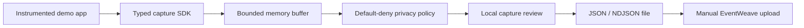
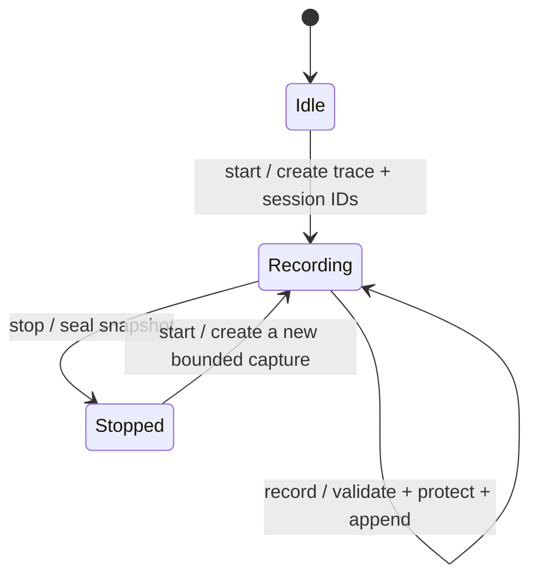
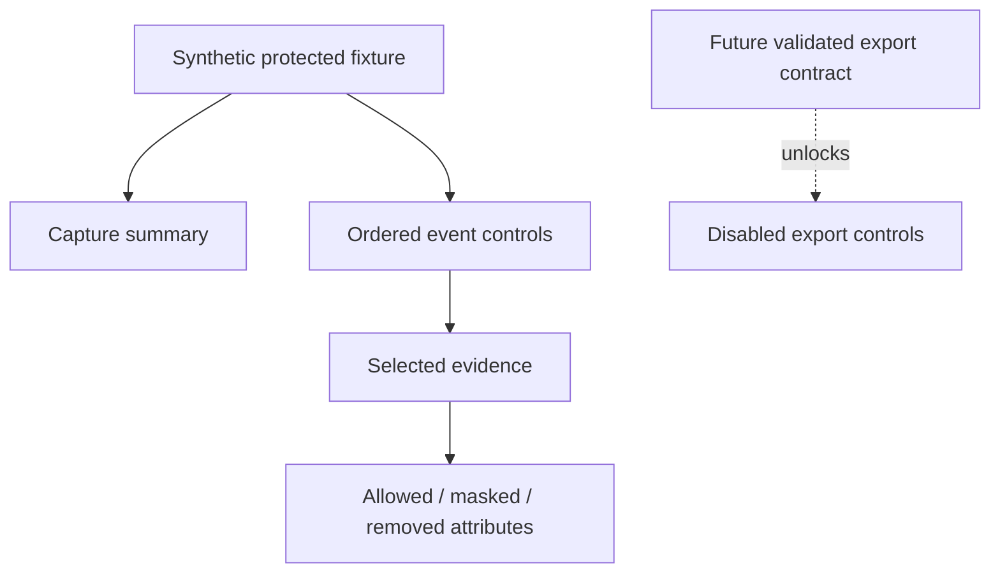

# TraceRelay architecture

## Product boundary

TraceRelay will create the structured evidence that EventWeave analyzes. Version one stays entirely local: an explicitly instrumented application records one bounded journey, applies a default-deny privacy policy, allows a human to review the result, and exports a file for manual EventWeave upload.

## Capture core

The capture core is a UI-independent boundary. It accepts only explicit instrumentation calls while a session is recording, protects attributes before retaining an event, and refuses new events at the configured hard limit so existing parent evidence is never silently removed.

Review snapshots retain privacy-treatment metadata for a human. EventWeave projections contain only approved or masked primitive attributes. JSON and NDJSON serialization preserve record order, stable IDs, ISO timestamps, outcomes, durations, and valid earlier-parent links.

## Current product-experience slice

The first Lumen increment intentionally begins at the review boundary so it can remain independent of the not-yet-implemented SDK. The synthetic view model contains only already-protected values and drives an accessible master-detail interface.

The core contract is now available for Lumen to replace the provisional fixture. Export controls remain disabled until the browser workflow explicitly starts/stops a real capture, presents its protected review, and confirms the download action.

## Privacy and safety constraints

- Capture is explicit, visible, bounded, and local.
- Attribute collection is default-deny.
- Passwords, tokens, payment data, arbitrary DOM content, and company data are never collected.
- Protected values must be masked or removed before the review model is rendered.
- Sensitive key families are removed even when mistakenly listed in the allow policy.
- The event cap rejects additional events and reports the count; it never evicts parent evidence.
- Version one exports a file only after local review; it never uploads automatically.
- The interface must describe missing functionality honestly and must not create a file from unvalidated sample data.

## Ownership

- **Atlas:** capture schema, SDK lifecycle, bounded buffer, identifiers, redaction, validation, compatibility, and core tests. The first core boundary is implemented in `src/lib/capture-core.ts`.
- **Lumen:** capture review, recording controls after the SDK lands, export workflow, demo journey, accessibility, responsive behavior, browser review, and integration documentation.
