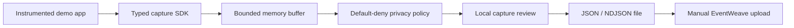
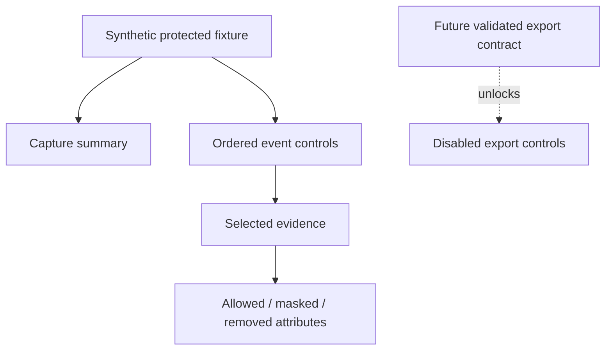

# TraceRelay architecture

## Product boundary

TraceRelay will create the structured evidence that EventWeave analyzes. Version one stays entirely local: an explicitly instrumented application records one bounded journey, applies a default-deny privacy policy, allows a human to review the result, and exports a file for manual EventWeave upload.

## Current product-experience slice

The first Lumen increment intentionally begins at the review boundary so it can remain independent of the not-yet-implemented SDK. The synthetic view model contains only already-protected values and drives an accessible master-detail interface.

This boundary prevents the interface from pretending that a capture or a valid EventWeave export exists before Atlas lands the schema, lifecycle, buffer, identifiers, and validation logic.

## Privacy and safety constraints

- Capture is explicit, visible, bounded, and local.
- Attribute collection is default-deny.
- Passwords, tokens, payment data, arbitrary DOM content, and company data are never collected.
- Protected values must be masked or removed before the review model is rendered.
- Version one exports a file only after local review; it never uploads automatically.
- The interface must describe missing functionality honestly and must not create a file from unvalidated sample data.

## Ownership

- **Atlas:** capture schema, SDK lifecycle, bounded buffer, identifiers, redaction, validation, compatibility, and core tests.
- **Lumen:** capture review, recording controls after the SDK lands, export workflow, demo journey, accessibility, responsive behavior, browser review, and integration documentation.
